## Part 1. Инструмент **ipcalc**
**== Задание ==**

#### 1.1. Сети и маски
##### Определи и запиши в отчёт:
##### 1) Адрес сети *192.167.38.54/13*
- 192.160.0.0/13
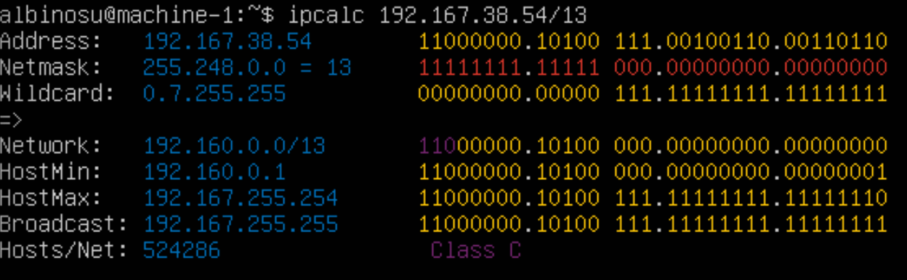

##### 2) Перевод маски *255.255.255.0* в префиксную и двоичную запись,
- 255.255.255.0 = /24 = 11111111.11111111.11111111.00000000
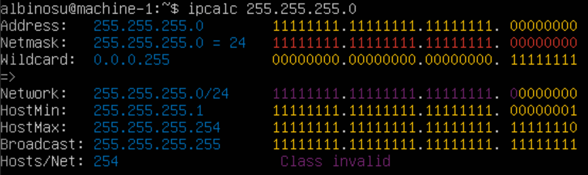

##### */15* в обычную и двоичную,
- /15 = 255.254.0.0 = 11111111.11111110.00000000.00000000
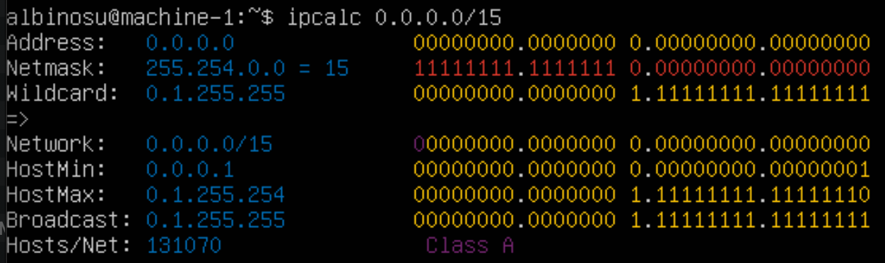

##### *11111111.11111111.11111111.11110000* в обычную и префиксную
- 11111111.11111111.11111111.11110000 = 255.255.255.240 = /28
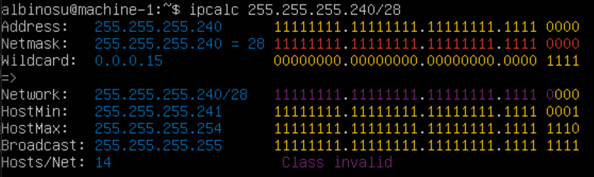

##### 3) Минимальный и максимальный хост в сети *12.167.38.4* при масках: */8*, *11111111.11111111.00000000.00000000*, *255.255.254.0* и */4*
/8: min 12.0.0.1, max 12.255.255.254
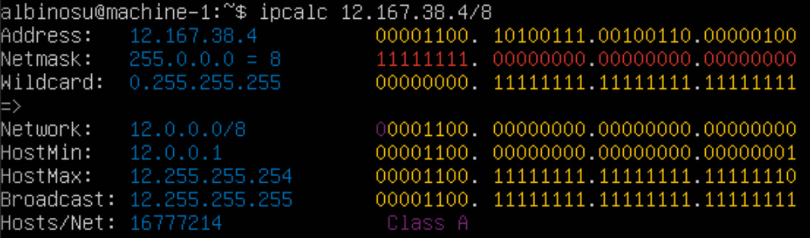

255.255.0.0 (/16): min 12.167.0.1, max 12.167.255.254
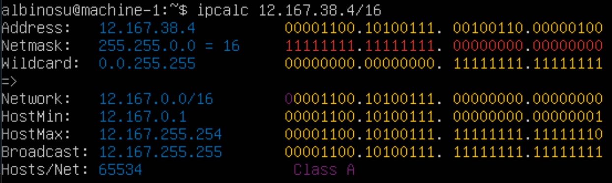

255.255.254.0 (/23): min 12.167.38.1, max 12.167.39.254
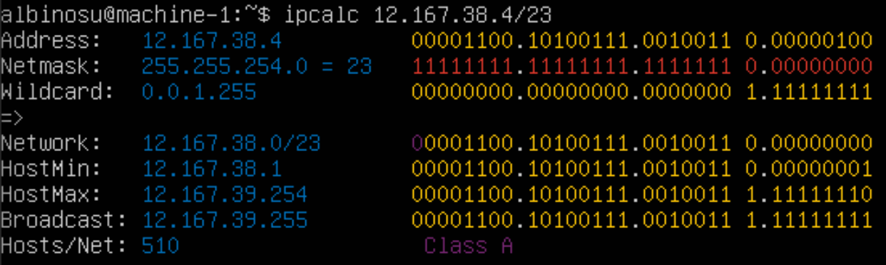

/4: min 0.0.0.1, max 15.255.255.254
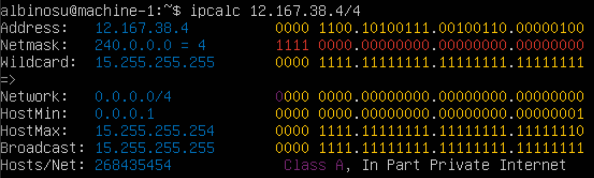


#### 1.2. localhosts
##### Определи и запиши в отчёт, можно ли обратиться к приложению, работающему на localhost, со следующими IP: 
*194.34.23.100* - нет

*127.0.0.2* - да

*127.1.0.1* - да

*128.0.0.1* - нет

#### 1.3. Диапазоны и сегменты сетей
Публичные: 134.43.0.2, 172.0.2.1, 192.172.0.1, 172.68.0.2, 192.169.168.1

Частные: 10.0.0.45, 192.168.4.2, 172.20.250.4, 172.16.255.255, 10.10.10.10

Возможные IP шлюза для 10.10.0.0/18: 10.10.0.2, 10.10.10.10, 10.10.1.255

## Part 2. Статическая маршрутизация между двумя машинами

##### Подними две виртуальные машины (далее -- ws1 и ws2).

##### С помощью команды `ip a` посмотри существующие сетевые интерфейсы.
- В отчёт помести скрин с вызовом и выводом использованной команды.
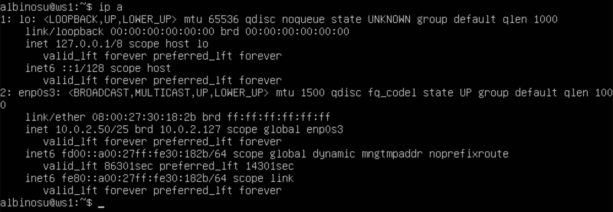
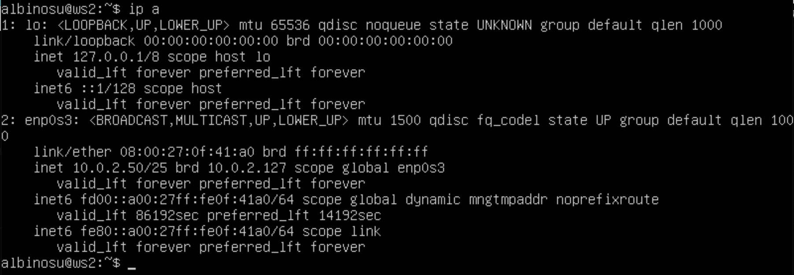

##### Опиши сетевой интерфейс, соответствующий внутренней сети, на обеих машинах и задай следующие адреса и маски: ws1 — *192.168.100.10*, маска */16*, ws2 — *172.24.116.8*, маска */12*.
- В отчёт помести скрины с содержанием изменённого файла *etc/netplan/00-installer-config.yaml* для каждой машины.
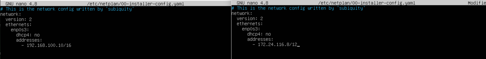

##### Выполни команду `netplan apply` для перезапуска сервиса сети.
- В отчёт помести скрин с вызовом и выводом использованной команды.
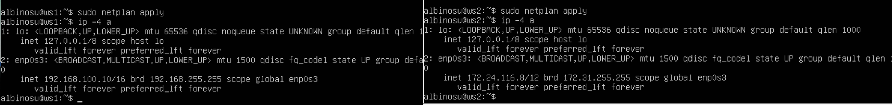


#### 2.1. Добавление статического маршрута вручную
##### Добавь статический маршрут от одной машины до другой и обратно при помощи команды вида `ip r add`.
##### Пропингуй соединение между машинами.
- В отчёт помести скрин с вызовом и выводом использованных команд.
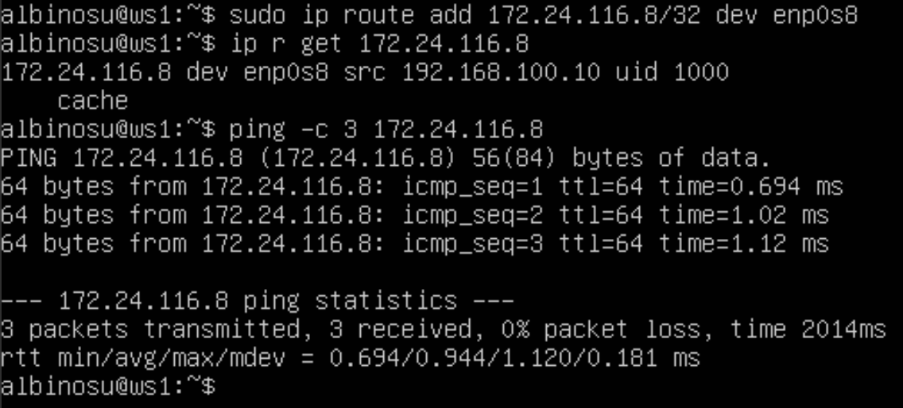
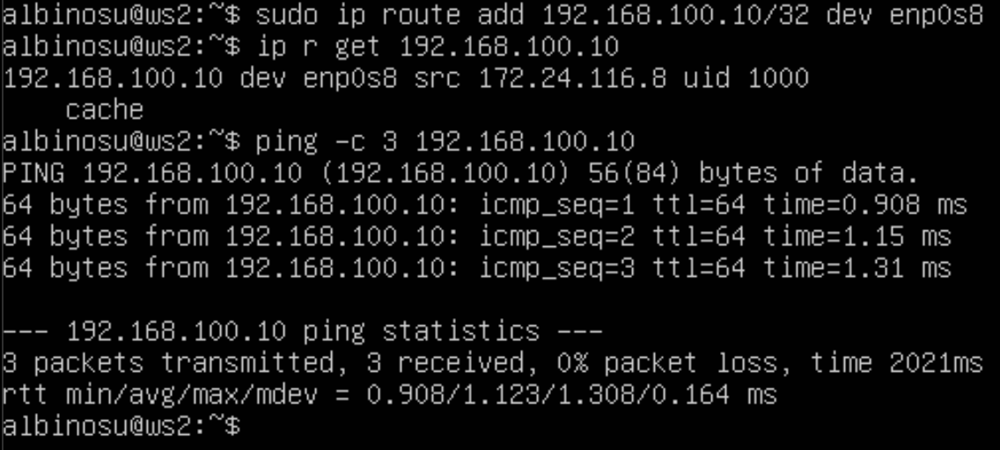

#### 2.2. Добавление статического маршрута с сохранением
##### Перезапусти машины.
##### Добавь статический маршрут от одной машины до другой с помощью файла */etc/netplan/00-installer-config.yaml*.
- В отчёт помести скрин с содержанием изменённого файла */etc/netplan/00-installer-config.yaml*.
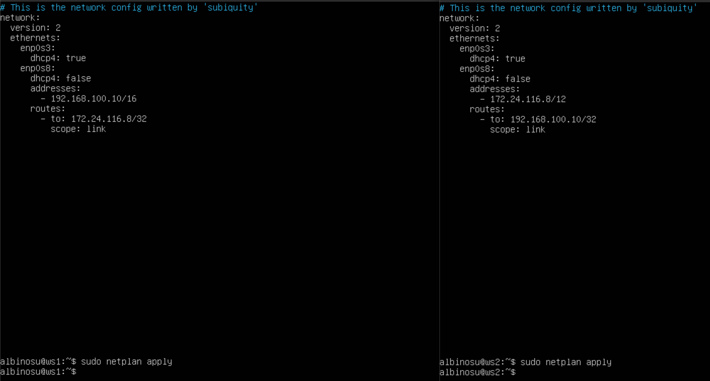

##### Пропингуй соединение между машинами.
- В отчёт помести скрин с вызовом и выводом использованной команды.
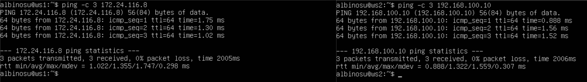

#### 3.1. Скорость соединения
##### Переведи и запиши в отчёт: 8 Mbps в MB/s, 100 MB/s в Kbps, 1 Gbps в Mbps.
8 Mbps = 1 MB/s
100 MB/s = 800,000 Kbps
1 Gbps = 1000 Mbps

#### 3.2. Утилита **iperf3**
##### Измерь скорость соединения между ws1 и ws2.
- В отчёт помести скрины с вызовом и выводом использованных команд.
iperf3 -c 172.24.116.8 -B 192.168.100.10 -t 10
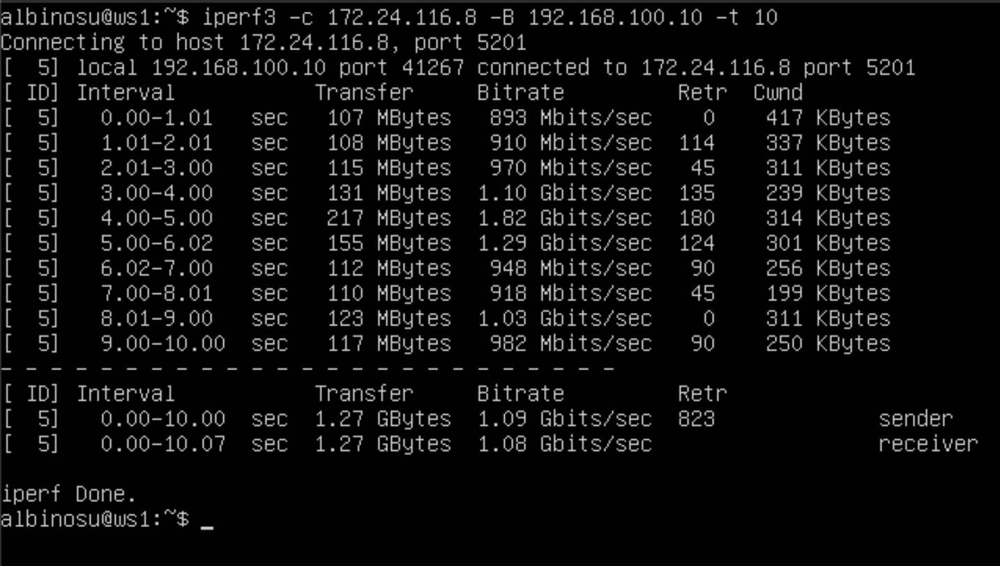
iperf3 -c 172.24.116.8 -B 192.168.100.10 -t 10 -R

iperf3 -c 172.24.116.8 -B 192.168.100.10 -t 10 -P 4
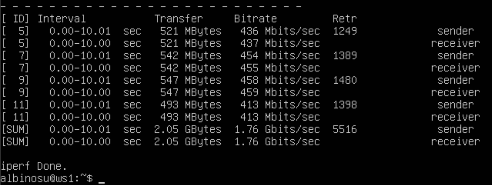

-s — сервер
-c — клиент
-B <IP> — привязка к внутреннему IP (чтобы трафик шёл по enp0s8)
-t 10 — тест 10 секунд
-R — реверс (сервер шлёт, клиент принимает)
-P 4 — 4 параллельных клиента

## Part 4. Сетевой экран
#### 4.1. Утилита **iptables**
##### Создай файл */etc/firewall.sh*, имитирующий файрвол, на ws1 и ws2:
```shell
#!/bin/sh

# Удаление всех правил в таблице «filter» (по умолчанию).
iptables -F
iptables -X
```
##### Нужно добавить в файл подряд следующие правила:
##### 1) На ws1 примени стратегию, когда в начале пишется запрещающее правило, а в конце пишется разрешающее правило (это касается пунктов 4 и 5).
##### 2) На ws2 примени стратегию, когда в начале пишется разрешающее правило, а в конце пишется запрещающее правило (это касается пунктов 4 и 5).
##### 3) Открой на машинах доступ для порта 22 (ssh) и порта 80 (http).
##### 4) Запрети *echo reply* (машина не должна «пинговаться», т. е. должна быть блокировка на OUTPUT).
##### 5) Разреши *echo reply* (машина должна «пинговаться»).
- В отчёт помести скрины с содержанием файла */etc/firewall* для каждой машины.
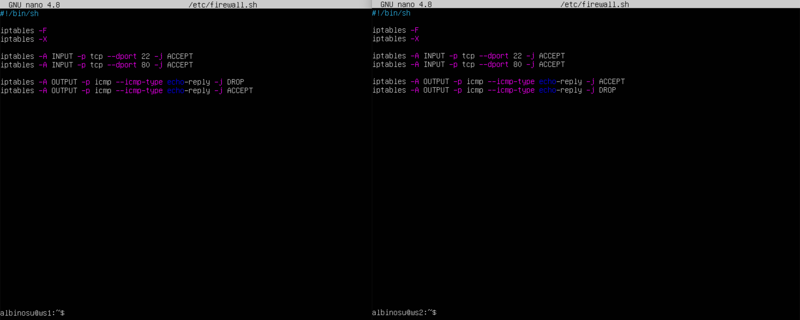
##### Запусти файлы на обеих машинах командами `chmod +x /etc/firewall.sh` и `/etc/firewall.sh`.
- В отчёт помести скрины с запуском обоих файлов.
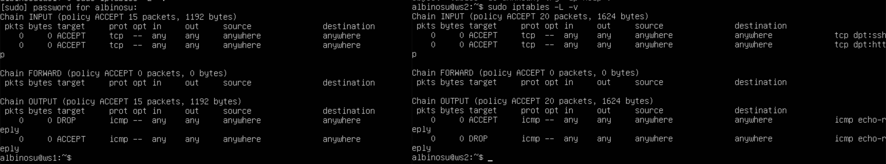
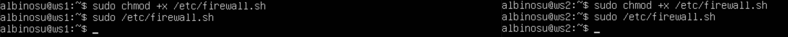
- В отчёте опиши разницу между стратегиями, применёнными в первом и втором файлах:
	- ws1: Правила применяются сверху вниз. Первое правило DROP блокирует echo-reply, второе ACCEPT не выполнится. Машина НЕ пингуется.
	- ws2: Первое правило ACCEPT разрешает echo-reply, второе DROP не применяется к уже разрешённым пакетам. Машина пингуется.


#### 4.2. Утилита **nmap**
##### Командой **ping** найди машину, которая не «пингуется», после чего утилитой **nmap** покажи, что хост машины запущен.
*Проверка: в выводе nmap должно быть сказано: `Host is up`*.
- В отчёт помести скрины с вызовом и выводом использованных команд **ping** и **nmap**.
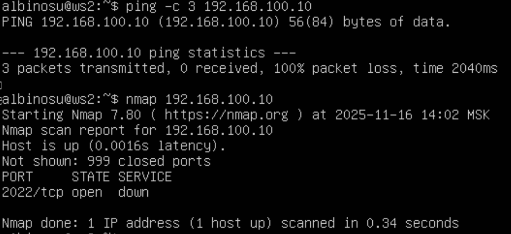

## Part 5. Статическая маршрутизация сети

##### Подними пять виртуальных машин (3 рабочие станции (ws11, ws21, ws22) и 2 роутера (r1, r2)).

#### 5.1. Настройка адресов машин
##### Настрой конфигурации машин в *etc/netplan/00-installer-config.yaml* согласно сети на рисунке.
- В отчёт помести скрины с содержанием файла *etc/netplan/00-installer-config.yaml* для каждой машины.
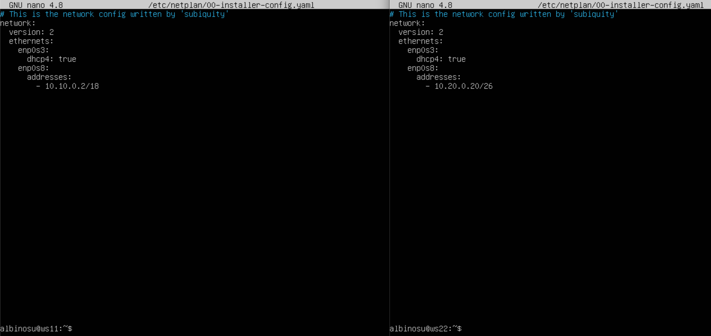
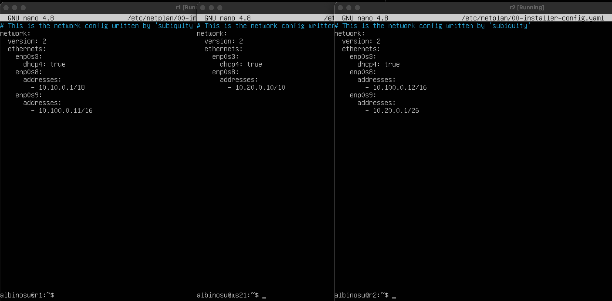
##### Перезапусти сервис сети. Если ошибок нет, командой `ip -4 a` проверь, что адрес машины задан верно. Также пропингуй ws22 с ws21. Аналогично пропингуй r1 с ws11.
- В отчёт помести скрины с вызовом и выводом использованных команд.
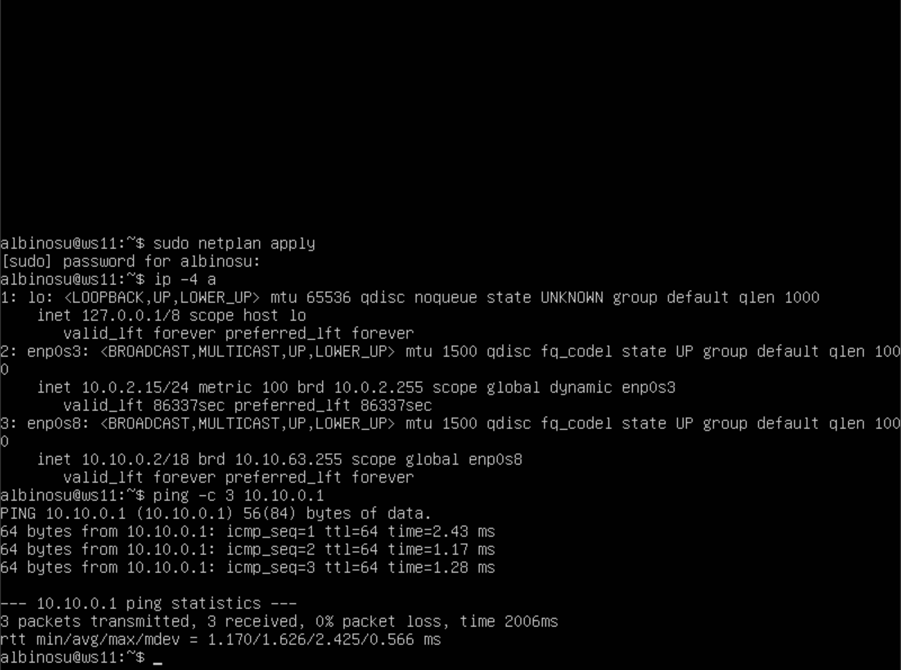
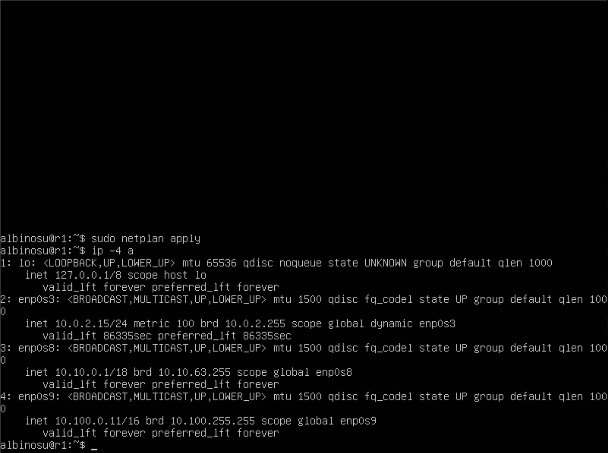
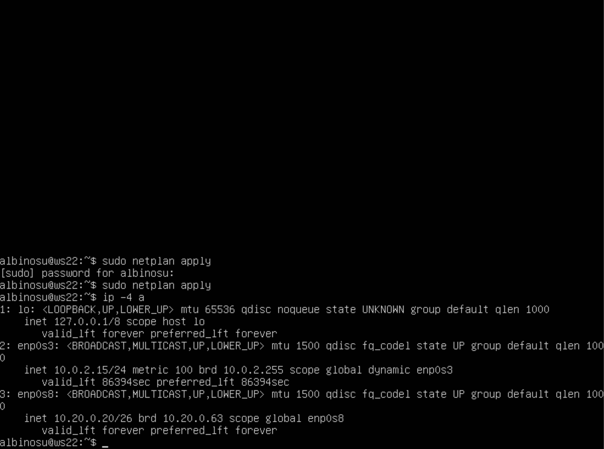
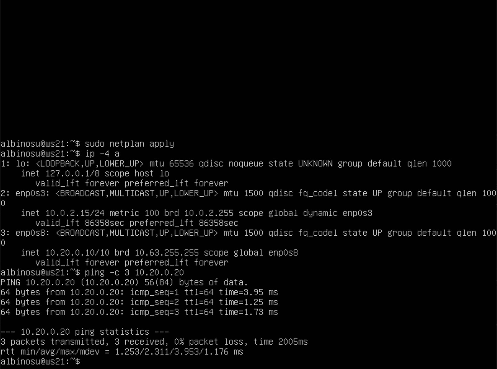
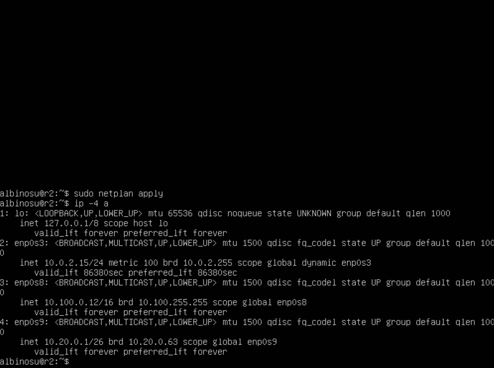

#### 5.2. Включение переадресации IP-адресов
##### Для включения переадресации IP выполни команду на роутерах:
`sysctl -w net.ipv4.ip_forward=1`
*При таком подходе переадресация не будет работать после перезагрузки системы.*
- В отчёт помести скрин с вызовом и выводом использованной команды.
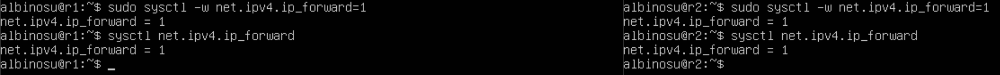
##### Открой файл */etc/sysctl.conf* и добавь в него следующую строку:
`net.ipv4.ip_forward = 1`
*При использовании этого подхода, IP-переадресация включена на постоянной основе.*
- В отчёт помести скрин с содержанием изменённого файла */etc/sysctl.conf*.
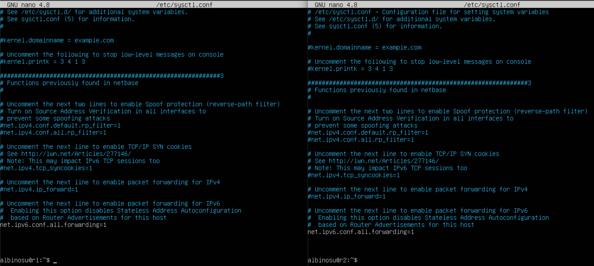

#### 5.3. Установка маршрута по умолчанию
Пример вывода команды `ip r` после добавления шлюза:
```
default via 10.10.0.1 dev eth0
10.10.0.0/18 dev eth0 proto kernel scope link src 10.10.0.2
```
##### Настрой маршрут по умолчанию (шлюз) для рабочих станций. Для этого добавь `default` перед IP-роутера в файле конфигураций.
- В отчёт помести скрин с содержанием файла *etc/netplan/00-installer-config.yaml*;
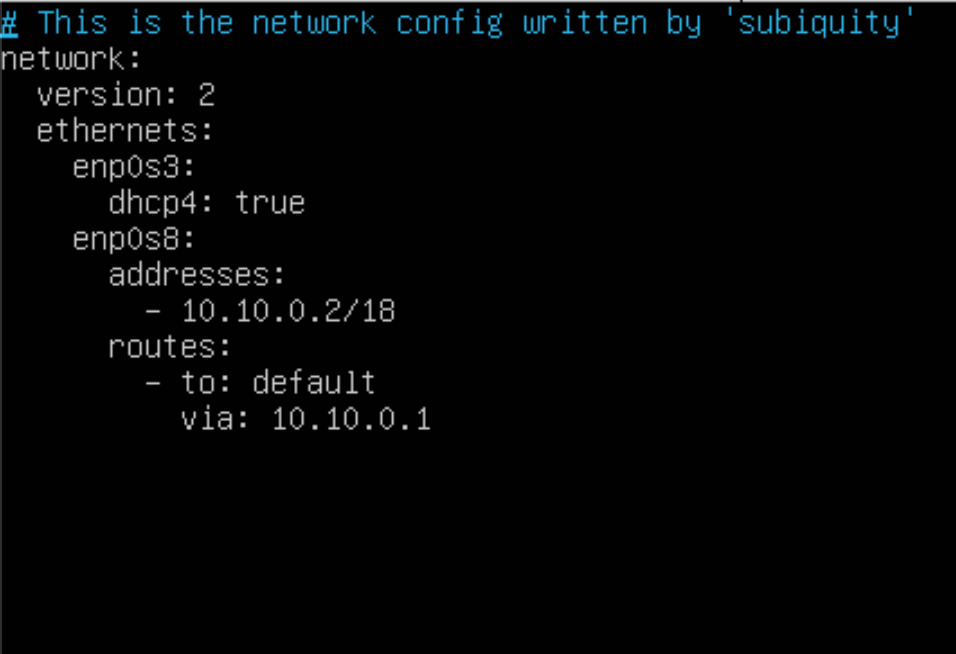
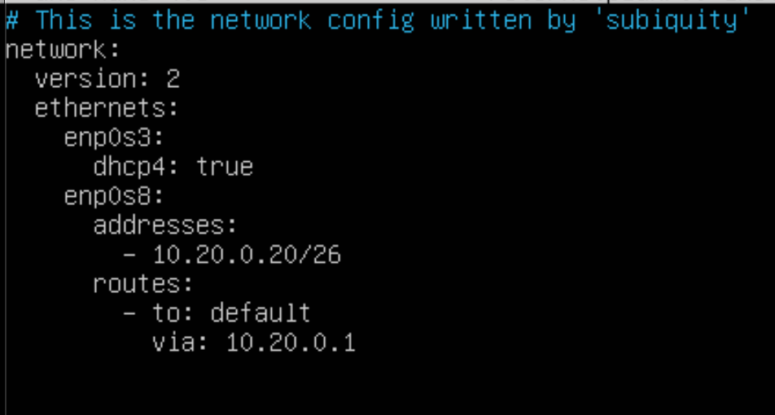
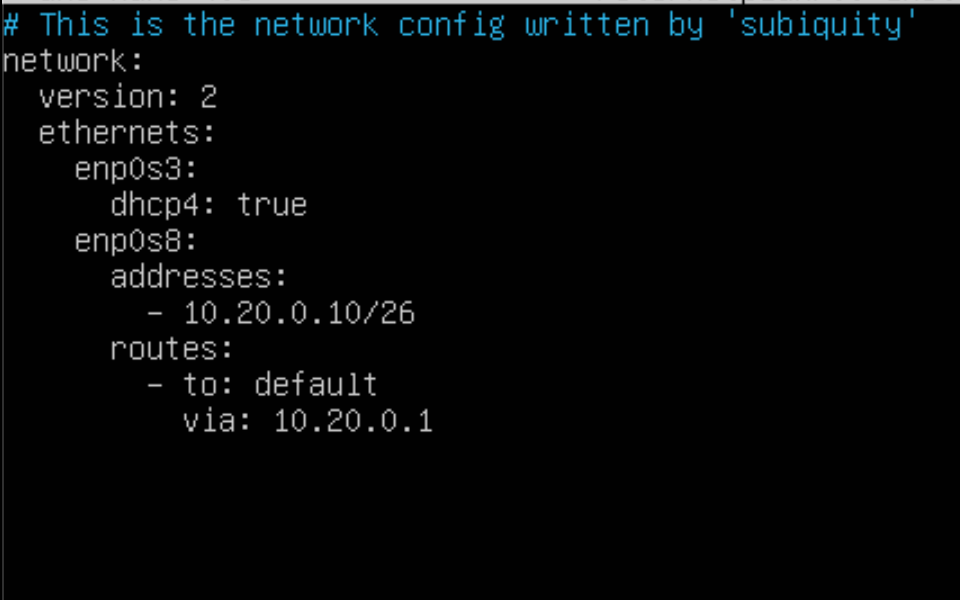
##### Вызови `ip r` и покажи, что добавился маршрут в таблицу маршрутизации.
- В отчёт помести скрин с вызовом и выводом использованной команды.
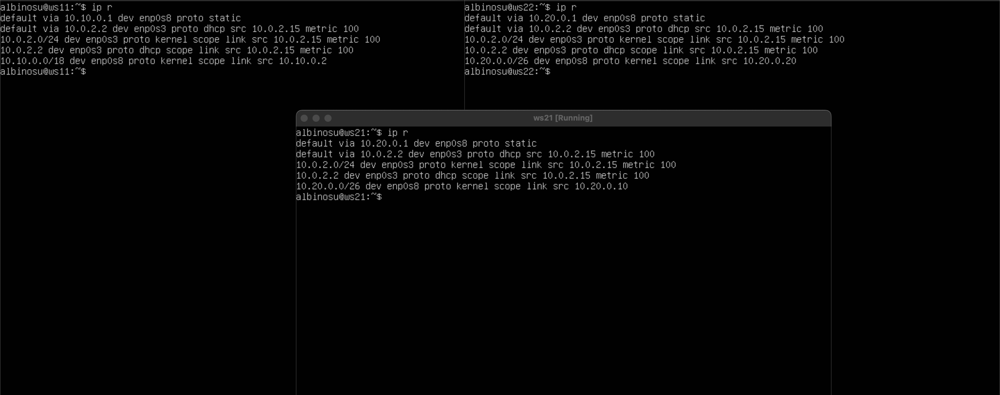
##### Пропингуй с ws11 роутер r2 и покажи на r2, что пинг доходит. Для этого используй команду:
`tcpdump -tn -i eth0`
- В отчёт помести скрин с вызовом и выводом использованных команд.
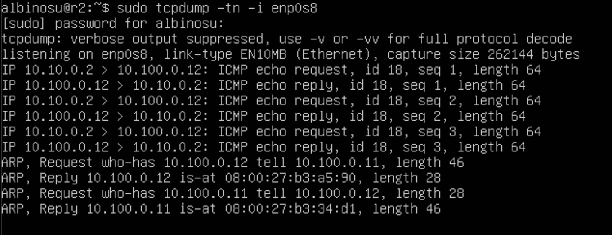

#### 5.4. Добавление статических маршрутов
##### Добавь в роутеры r1 и r2 статические маршруты в файле конфигураций. Пример для r1 маршрута в сетку 10.20.0.0/26:
```shell
# Добавь в конец описания сетевого интерфейса eth1:
- to: 10.20.0.0
  via: 10.100.0.12 
```
- В отчёт помести скрины с содержанием изменённого файла *etc/netplan/00-installer-config.yaml* для каждого роутера.
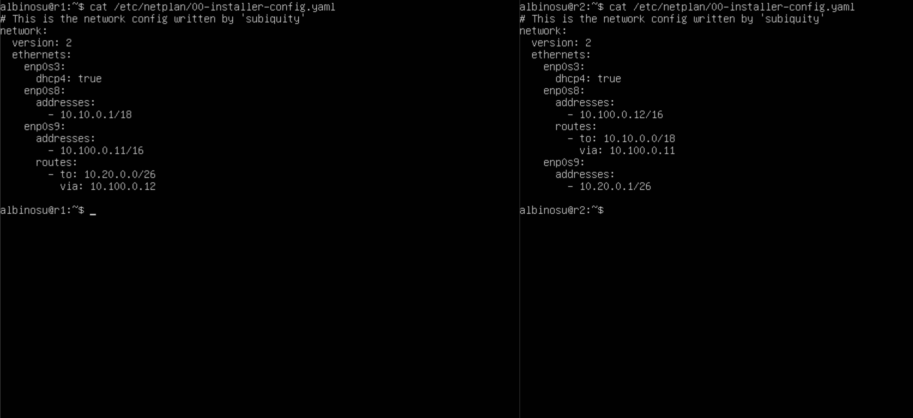
##### Вызови `ip r` и покажи таблицы с маршрутами на обоих роутерах. Пример таблицы на r1:
```
10.100.0.0/16 dev eth1 proto kernel scope link src 10.100.0.11
10.20.0.0/26 via 10.100.0.12 dev eth1
10.10.0.0/18 dev eth0 proto kernel scope link src 10.10.0.1
```
- В отчёт помести скрин с вызовом и выводом использованной команды.
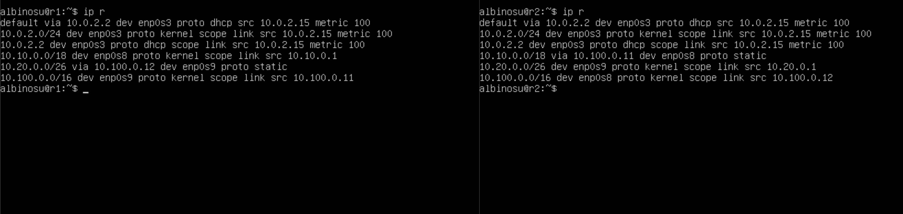
##### Запусти команды на ws11:
`ip r list 10.10.0.0/[маска сети]` и `ip r list 0.0.0.0/0`
- В отчёт помести скрин с вызовом и выводом использованных команд;
- В отчёте объясни, почему для адреса 10.10.0.0/\[маска сети\] был выбран маршрут, отличный от 0.0.0.0/0, хотя он попадает под маршрут по умолчанию.
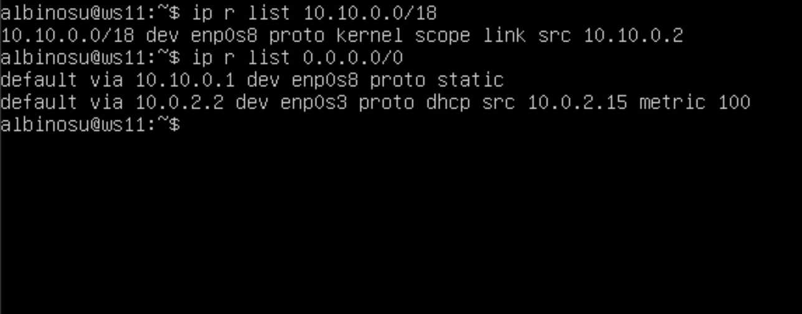

	- Для адреса 10.10.0.0/18 был выбран маршрут, отличный от 0.0.0.0/0, потому что в Linux используется принцип longest prefix match (наиболее длинное совпадение префикса). Маршрут с более специфичной маской (/18 = 14 бит сети) имеет приоритет над маршрутом по умолчанию (/0 = 0 бит сети), так как он более точно описывает конкретную сеть назначения.

#### 5.5. Построение списка маршрутизаторов
Пример вывода утилиты **traceroute** после добавления шлюза:
```
1 10.10.0.1 0 ms 1 ms 0 ms
2 10.100.0.12 1 ms 0 ms 1 ms
3 10.20.0.10 12 ms 1 ms 3 ms
```
##### Запусти на r1 команду дампа:
`tcpdump -tnv -i eth0`
##### При помощи утилиты **traceroute** построй список маршрутизаторов на пути от ws11 до ws21.
- В отчёт помести скрины с вызовом и выводом использованных команд (tcpdump и traceroute);
- В отчёте, опираясь на вывод, полученный из дампа на r1, объясни принцип работы построения пути при помощи **traceroute**.
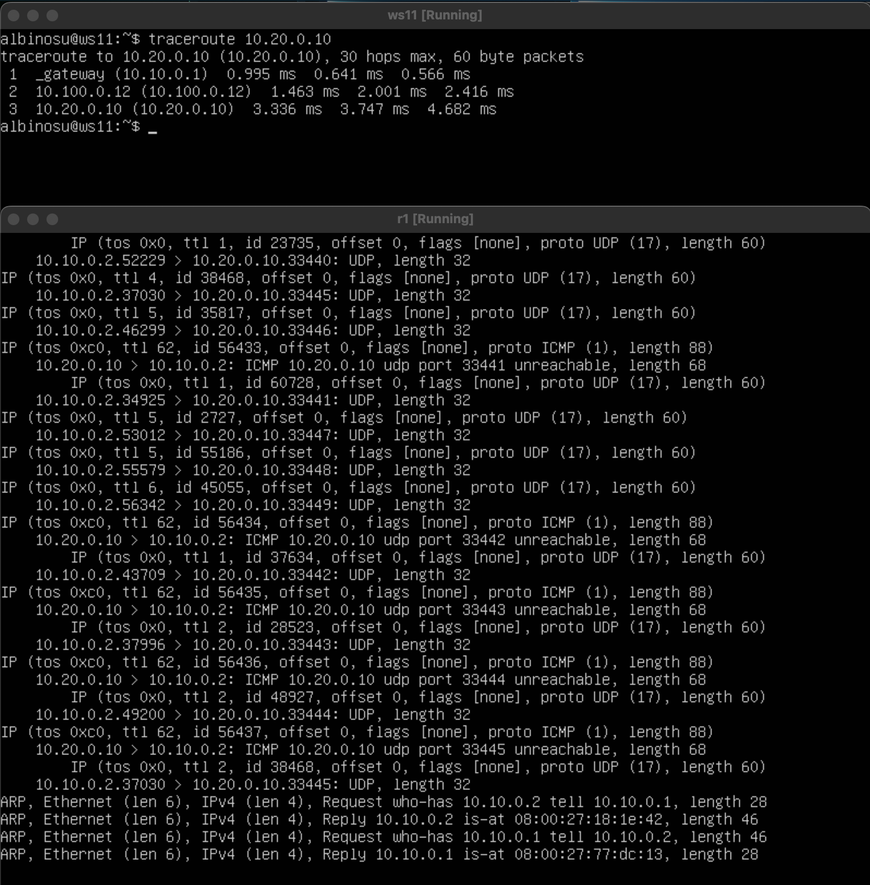

- Утилита traceroute определяет маршрут до узла назначения, отправляя последовательность пакетов с постепенно увеличивающимся значением TTL (Time To Live). Первый пакет отправляется с TTL=1. Когда он достигает первого маршрутизатора (r1), тот уменьшает TTL до 0 и отправляет обратно ICMP-сообщение "Time Exceeded" с указанием своего IP-адреса. Так определяется первый хоп. Второй пакет с TTL=2 проходит через r1 (TTL становится 1), достигает r2, где TTL уменьшается до 0, и r2 отправляет "Time Exceeded". Так определяется второй хоп. Третий пакет с TTL=3 достигает конечного узла ws21, который отправляет ICMP Echo Reply или UDP Port Unreachable, сигнализируя о достижении цели. В tcpdump на r1 это видно как последовательность пакетов с разными TTL и соответствующие ICMP Time Exceeded ответы.


#### 5.6. Использование протокола **ICMP** при маршрутизации
##### Запусти на r1 перехват сетевого трафика, проходящего через eth0 с помощью команды:
`tcpdump -n -i eth0 icmp`
##### Пропингуй с ws11 несуществующий IP (например, *10.30.0.111*) с помощью команды:
`ping -c 1 10.30.0.111`
- В отчёт помести скрин с вызовом и выводом использованных команд.
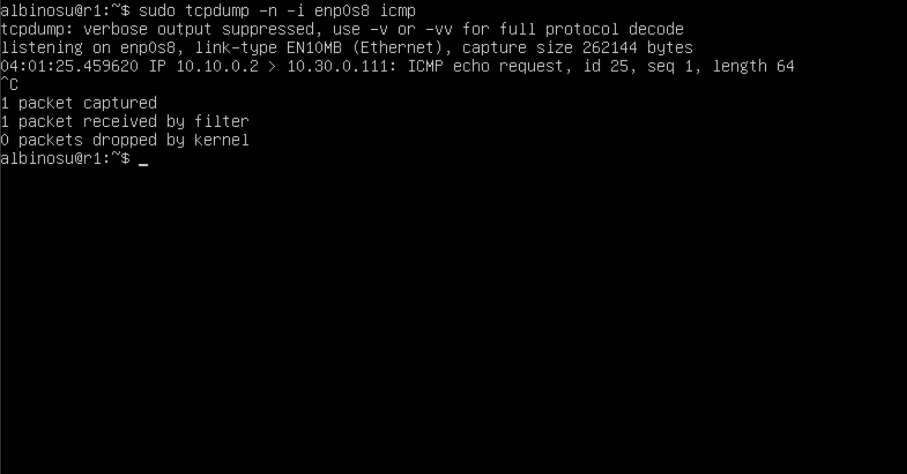

## Part 6. Динамическая настройка IP с помощью **DHCP**

*В данном задании используются виртуальные машины из Части 5.*

##### Для r2 настрой в файле */etc/dhcp/dhcpd.conf* конфигурацию службы **DHCP**:
##### 1) Укажи адрес маршрутизатора по умолчанию, DNS-сервер и адрес внутренней сети. Пример файла для r2:
```shell
subnet 10.100.0.0 netmask 255.255.0.0 {}

subnet 10.20.0.0 netmask 255.255.255.192
{
    range 10.20.0.2 10.20.0.50;
    option routers 10.20.0.1;
    option domain-name-servers 10.20.0.1;
}
```
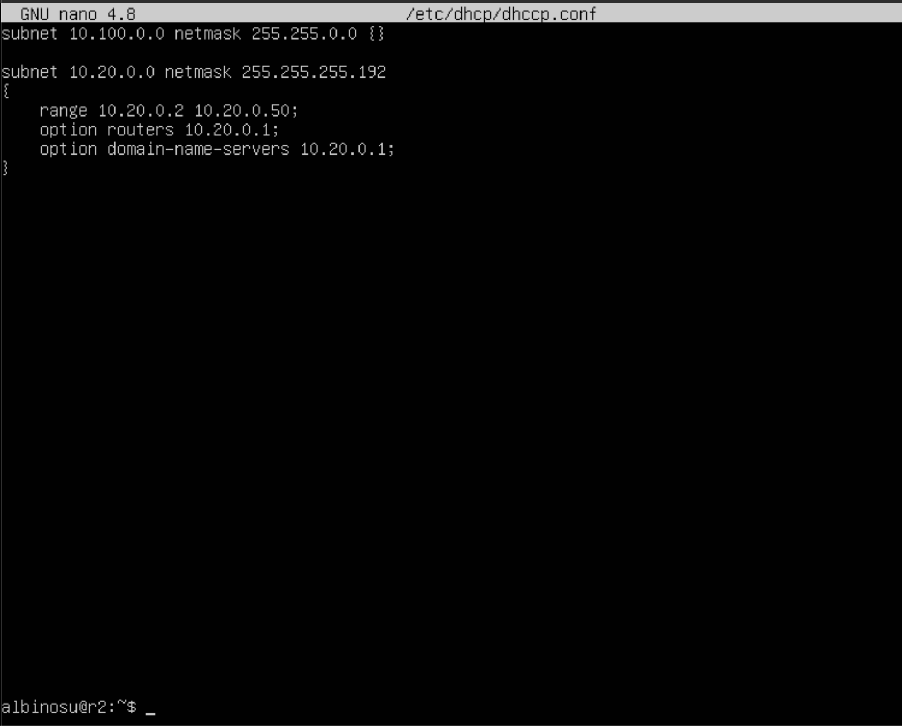
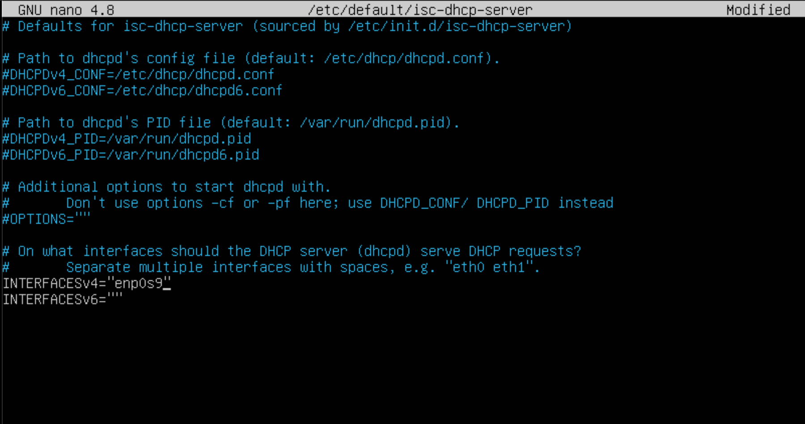
##### 2) В файле *resolv.conf* пропиш3 `nameserver 8.8.8.8`.
- В отчёт помести скрины с содержанием изменённых файлов.
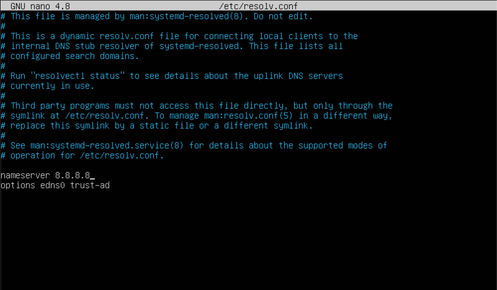
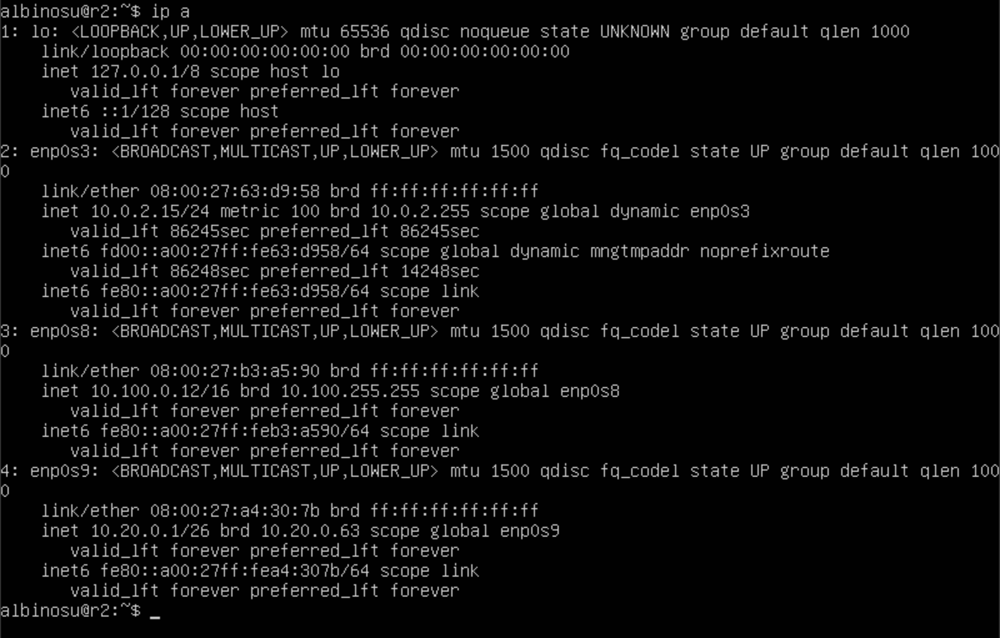
##### Перезагрузи службу **DHCP** командой `systemctl restart isc-dhcp-server`. Машину ws21 перезагрузи при помощи `reboot` и через `ip a` покажи, что она получила адрес. Также пропингуй ws22 с ws21.
- В отчёт помести скрины с вызовом и выводом использованных команд.
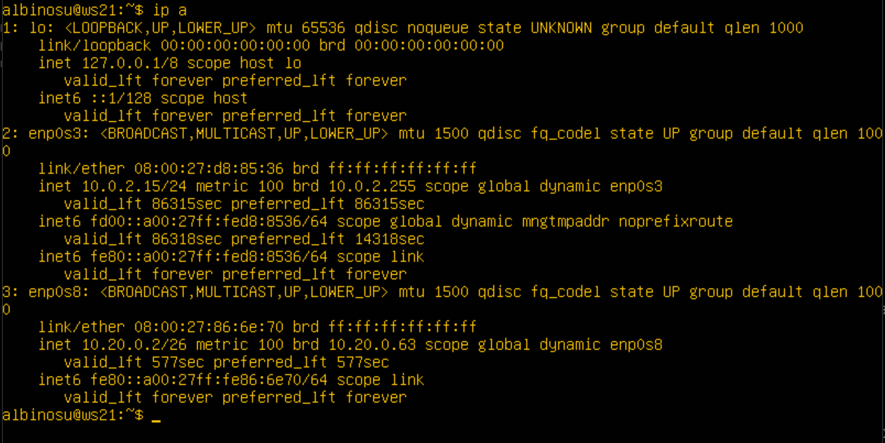
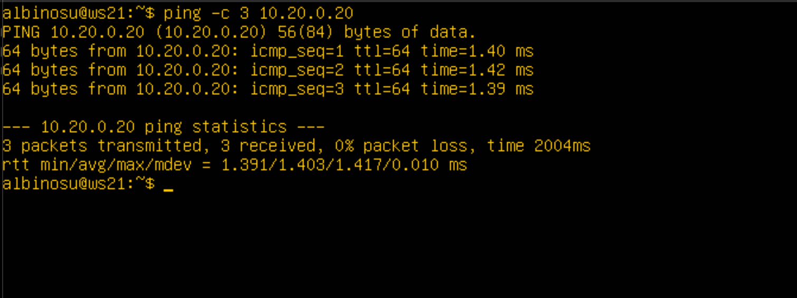

##### Укажи MAC-адрес у ws11, для этого в *etc/netplan/00-installer-config.yaml* надо добавить строки: `macaddress: 10:10:10:10:10:BA`, `dhcp4: true`.
- В отчёт помести скрин с содержанием изменённого файла *etc/netplan/00-installer-config.yaml*.
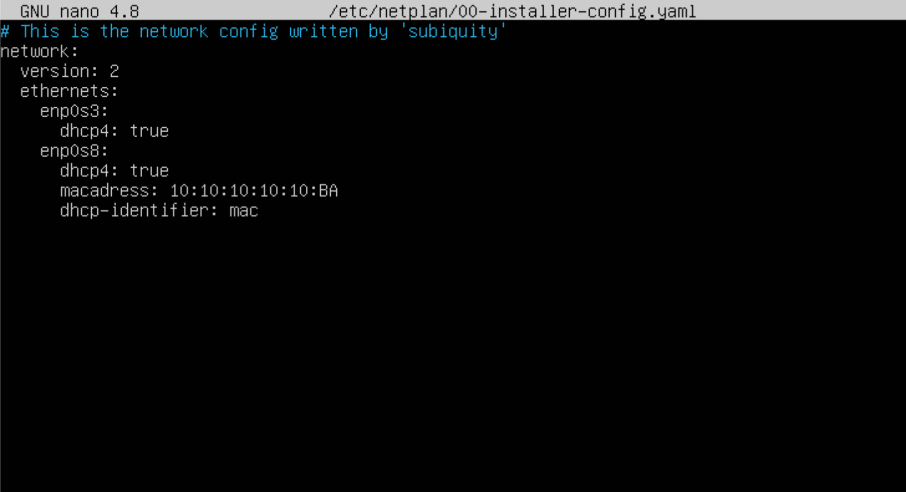
##### Для r1 настрой аналогично r2, но сделай выдачу адресов с жесткой привязкой к MAC-адресу (ws11). Проведи аналогичные тесты.
- В отчёте этот пункт опиши аналогично настройке для r2.
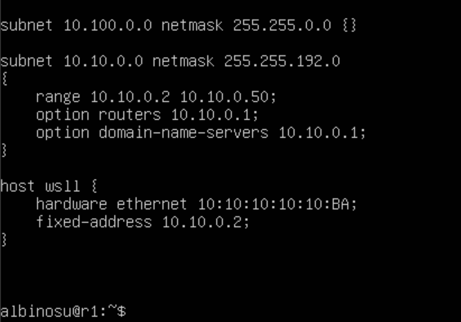
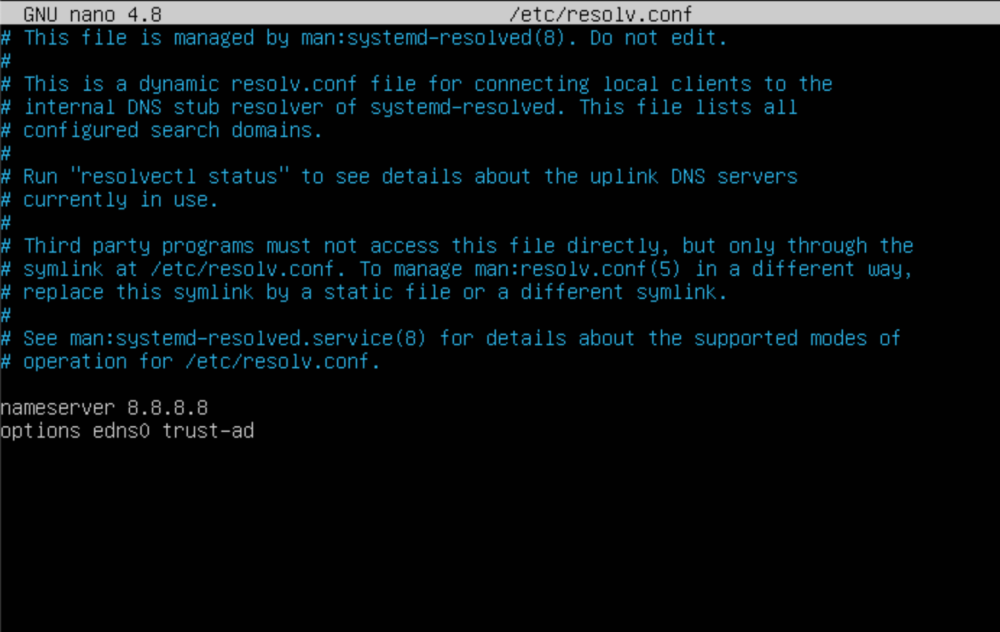
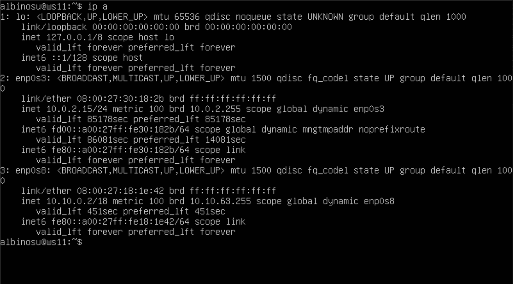
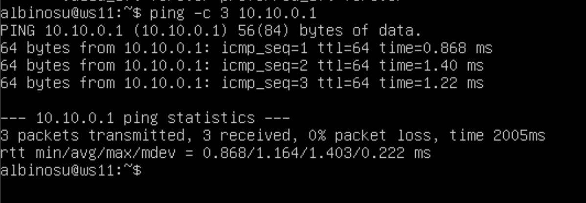

##### Запроси с ws21 обновление IP-адреса.
- В отчёте помести скрины IP до и после обновления.
- В отчёте опиши, какими опциями **DHCP** сервера пользовался в данном пункте.
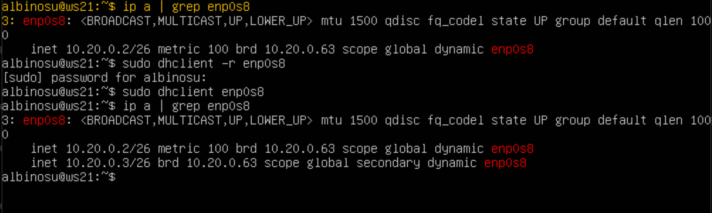

	- dhclient -r enp0s8 — освобождает текущий IP-адрес, отправляя DHCPRELEASE серверу
	- dhclient enp0s8 — запрашивает новый IP-адрес через процесс DHCP Handshake:
	- DHCPDISCOVER (клиент ищет DHCP-сервер)
	- DHCPOFFER (сервер предлагает IP)
	- DHCPREQUEST (клиент запрашивает предложенный IP)
	- DHCPACK (сервер подтверждает выдачу IP)

## Part 7. **NAT**

*В данном задании используются виртуальные машины из Части 5.*
##### В файле */etc/apache2/ports.conf* на ws22 и r1 измени строку `Listen 80` на `Listen 0.0.0.0:80`, то есть сделай сервер Apache2 общедоступным.
- В отчёт помести скрин с содержанием изменённого файла.
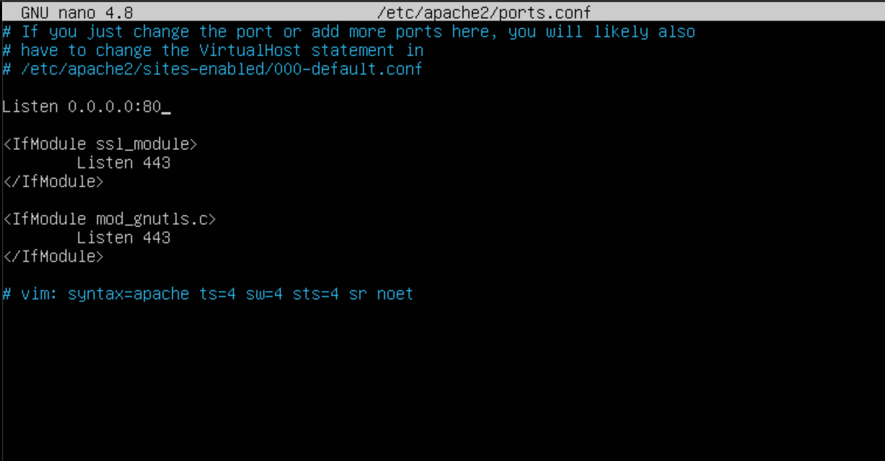
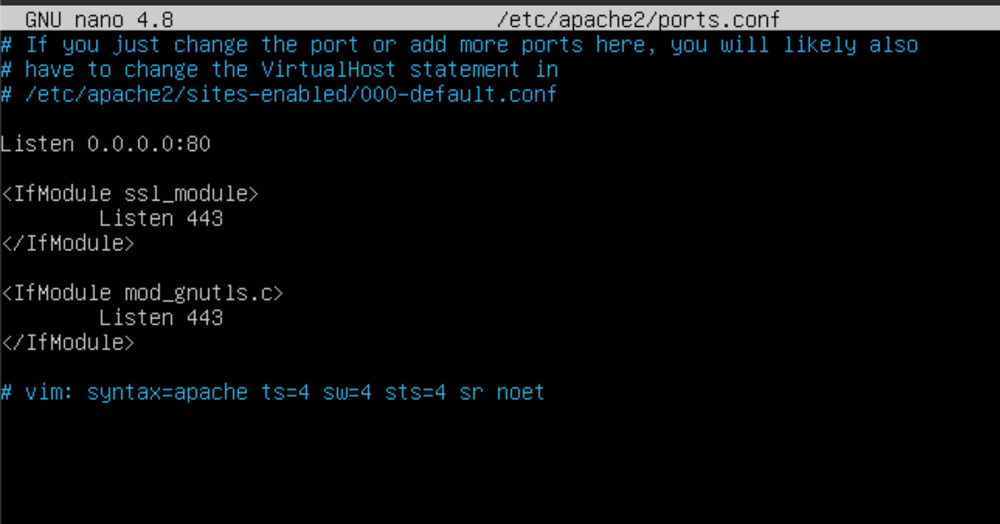
##### Запусти веб-сервер Apache командой `service apache2 start` на ws22 и r1.
- В отчёт помести скрины с вызовом и выводом использованной команды.
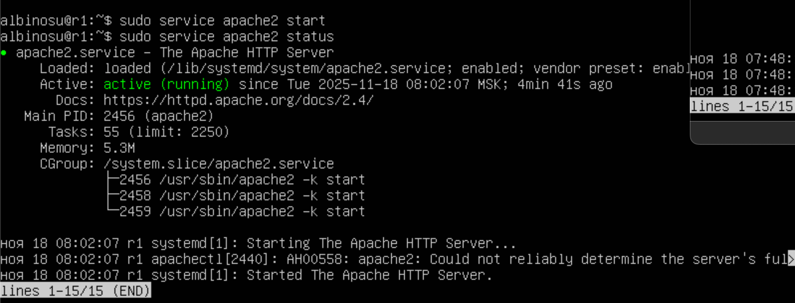
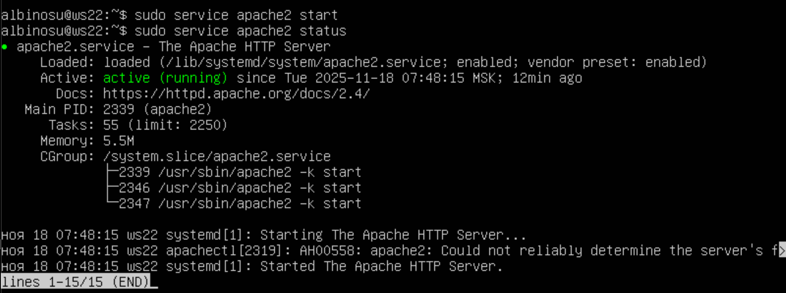
##### Добавь в фаервол, созданный по аналогии с фаерволом из Части 4, на r2 следующие правила:
##### 1) Удаление правил в таблице filter — `iptables -F`;
##### 2) Удаление правил в таблице «NAT» — `iptables -F -t nat`;
##### 3) Отбрасывать все маршрутизируемые пакеты — `iptables --policy FORWARD DROP`.
##### Запусти файл также, как в Части 4.
##### Проверь соединение между ws22 и r1 командой `ping`.
*При запуске файла с этими правилами, ws22 не должна «пинговаться» с r1.*
- В отчёт помести скрины с вызовом и выводом использованной команды.
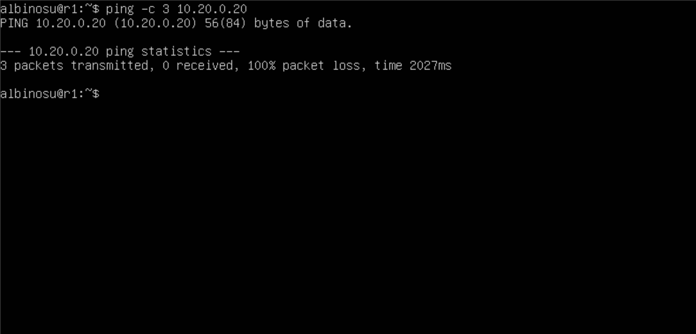
##### Добавь в файл ещё одно правило:
##### 4) Разрешить маршрутизацию всех пакетов протокола **ICMP**.
##### Запусти файл также, как в Части 4.
##### Проверь соединение между ws22 и r1 командой `ping`.
*При запуске файла с этими правилами, ws22 должна «пинговаться» с r1.*
- В отчёт помести скрины с вызовом и выводом использованной команды.
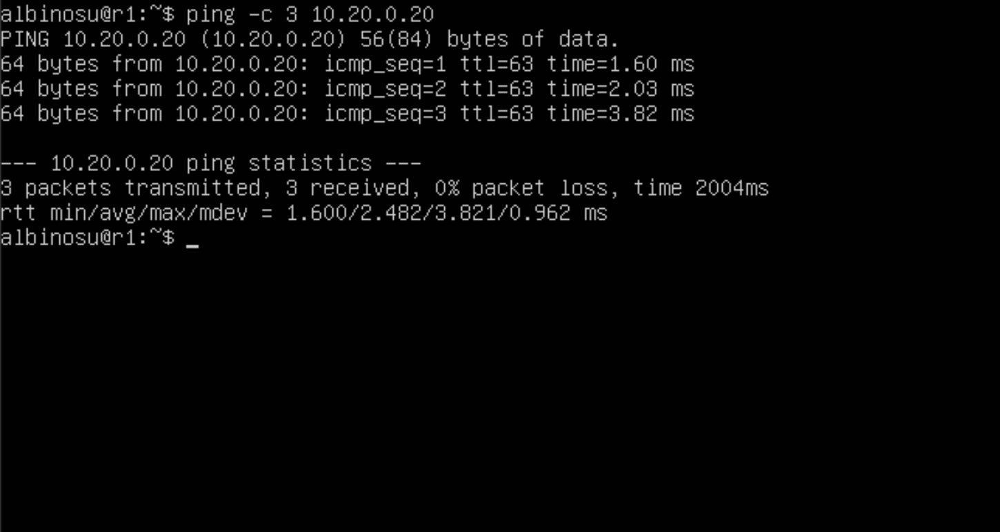
##### Добавь в файл ещё два правила:
##### 5) Включи **SNAT**, а именно маскирование всех локальных IPиз локальной сети, находящейся за r2 (по обозначениям из Части 5 — сеть 10.20.0.0).
*Совет: стоит подумать о маршрутизации внутренних пакетов, а также внешних пакетов с установленным соединением.*
##### 6) Включи **DNAT** на 8080 порт машины r2 и добавить к веб-серверу Apache, запущенному на ws22, доступ извне сети.
*Совет: стоит учесть, что при попытке подключения возникнет новое tcp-соединение, предназначенное ws22 и 80 порту.*
- В отчёт помести скрин с содержанием изменённого файла.
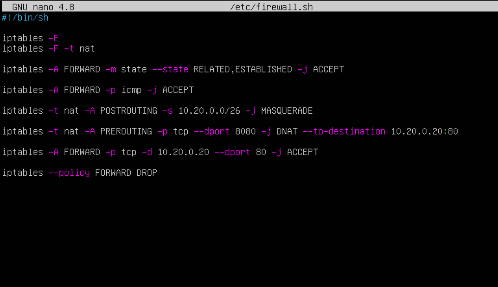
	- MASQUERADE — автоматически подменяет source IP на IP интерфейса r2 (SNAT)
	- PREROUTING DNAT — входящие на r2:8080 перенаправляются на ws22:80
	- --state RELATED,ESTABLISHED — разрешает ответные пакеты для установленных соединений
	- FORWARD ... --dport 80 — разрешает новые TCP-соединения к ws22:80
##### Запусти файл также, как в Части 4.
*Перед тестированием рекомендуется отключить сетевой интерфейс **NAT** (его наличие можно проверить командой `ip a`) в VirtualBox, если он включен.*
##### Проверь соединение по TCP для **SNAT**: для этого с ws22 подключиться к серверу Apache на r1 командой:
`telnet [адрес] [порт]`
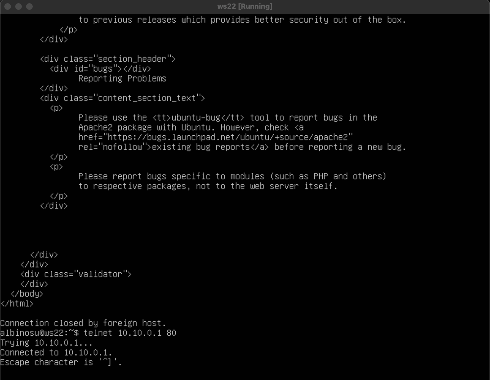
##### Проверь соединение по TCP для **DNAT**: для этого с r1 подключиться к серверу Apache на ws22 командой `telnet` (обращаться по адресу r2 и порту 8080).
- В отчёт помести скрины с вызовом и выводом использованных команд.
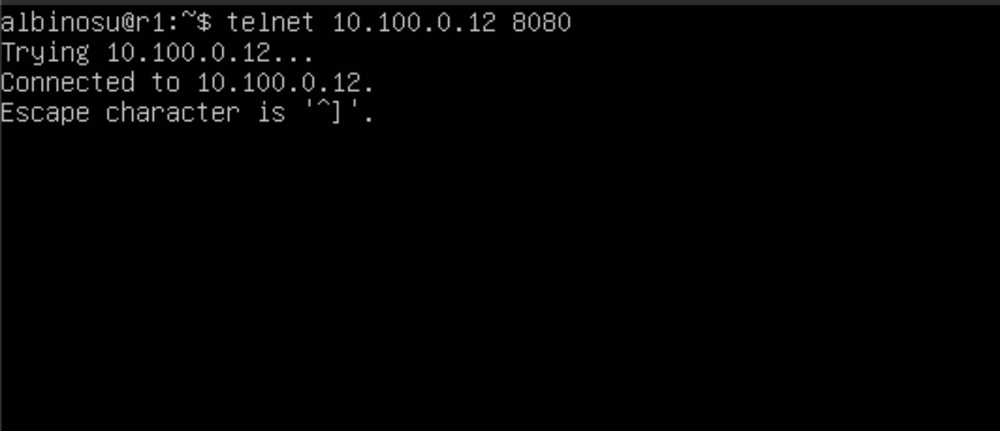
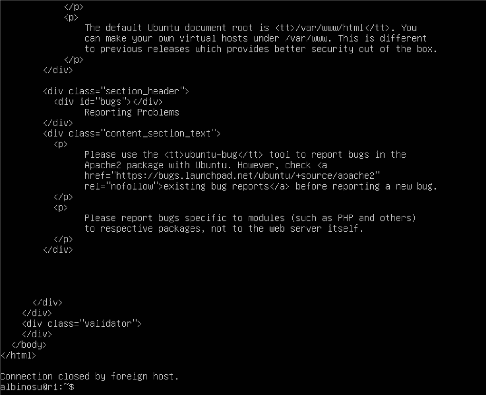

## Part 8. Дополнительно. Знакомство с **SSH Tunnels**

##### Запусти на r2 фаервол с правилами из Части 7.
##### Запусти веб-сервер **Apache** на ws22 только на localhost (то есть в файле */etc/apache2/ports.conf* измени строку `Listen 80` на `Listen localhost:80`).
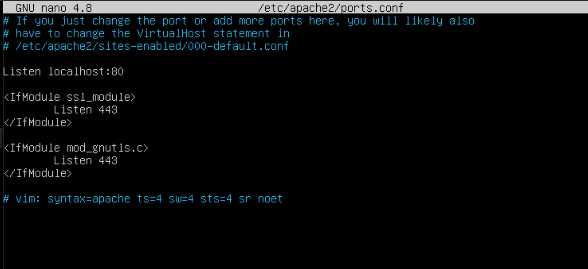
##### Воспользуйся *Local TCP forwarding* с ws21 до ws22, чтобы получить доступ к веб-серверу на ws22 с ws21.
##### Воспользуйся *Remote TCP forwarding* c ws11 до ws22, чтобы получить доступ к веб-серверу на ws22 с ws11.
##### Для проверки, сработало ли подключение в обоих предыдущих пунктах, перейди во второй терминал (например, клавишами Alt + F2) и выполни команду:
`telnet 127.0.0.1 [локальный порт]`
- В отчёте опиши команды, необходимые для выполнения этих четырёх пунктов, а также приложи скриншоты с их вызовом и выводом.
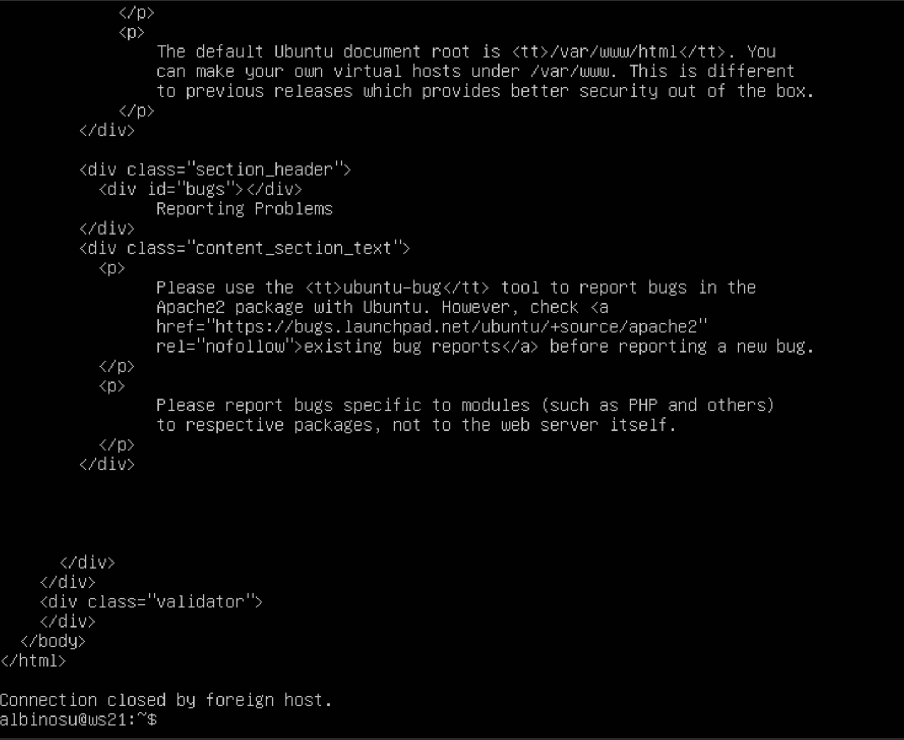
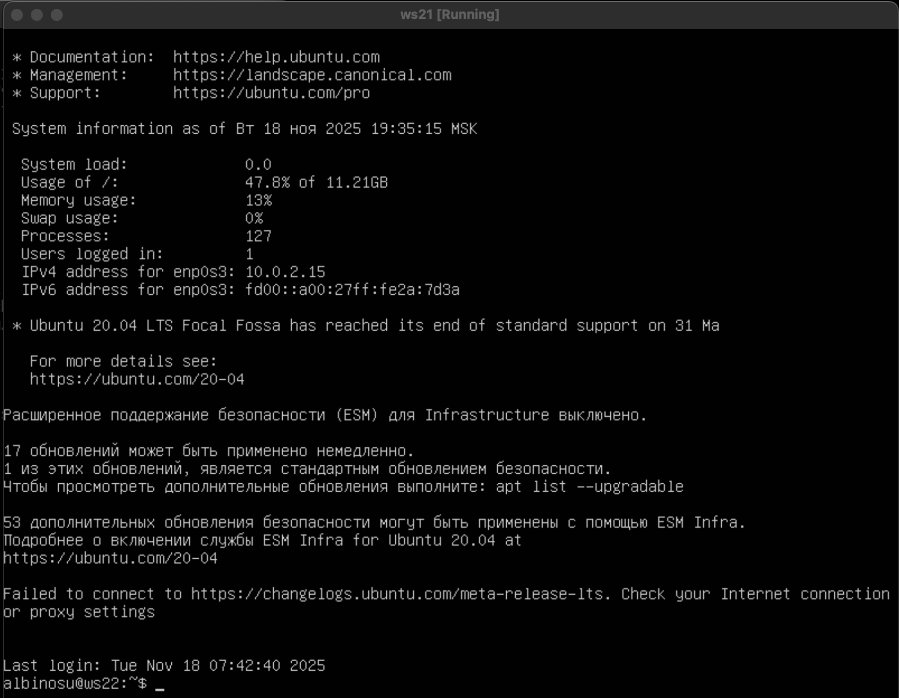


#### 1. Запуск firewall на r2:
sudo /etc/firewall.sh

#### 2. Настройка Apache на ws22 (только localhost):
sudo nano /etc/apache2/ports.conf Изменить: Listen 0.0.0.0:80 → Listen localhost:80
sudo systemctl restart apache2

#### 3. Local TCP Forwarding с ws21 до ws22:
**На ws21:**
ssh -p 2022 -L 8080:localhost:80 albinosu@10.20.0.20


**Проверка (второй терминал, Alt+F2):**
telnet 127.0.0.1 8080
GET / HTTP/1.1
Host: 127.0.0.1


#### 4. Remote TCP Forwarding с ws11 до ws22:
**На ws11:**
ssh -p 2022 -R 8888:localhost:80 albinosu@10.20.0.20

**Проверка (второй терминал, Alt+F2):**
telnet 127.0.0.1 8888
GET / HTTP/1.1
Host: 127.0.0.1
