## Part 1. Готовый докер

**== Задание ==**

##### Возьми официальный докер-образ с **nginx** и выкачай его при помощи `docker pull`.
##### Проверь наличие докер-образа через `docker images`.
##### Запусти докер-образ через `docker run -d [image_id|repository]`.
##### Проверь, что образ запустился через `docker ps`.
##### Посмотри информацию о контейнере через `docker inspect [container_id|container_name]`.
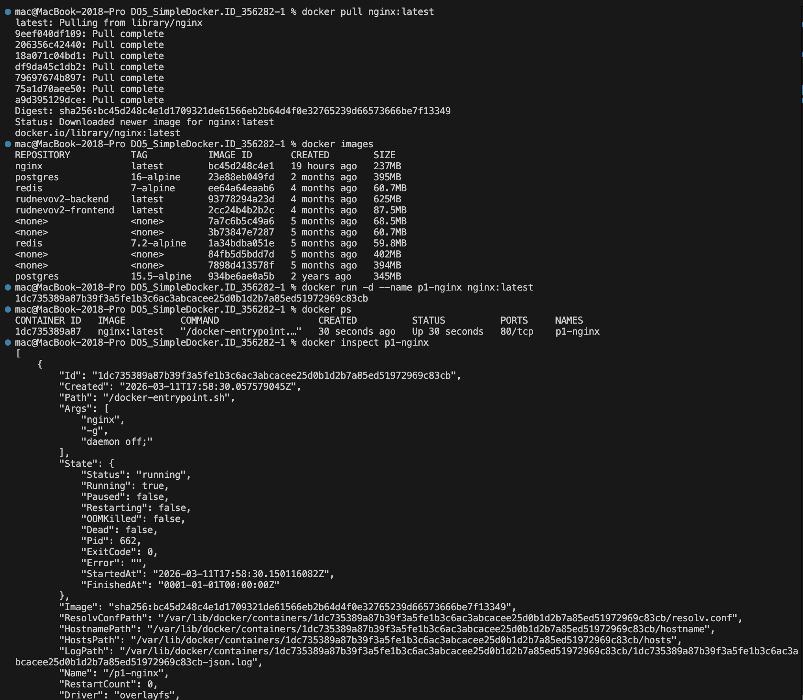
##### По выводу команды определи и помести в отчёт размер контейнера, список замапленных портов и ip контейнера.
Size: 81,9Kb (virtual 174 Mb)
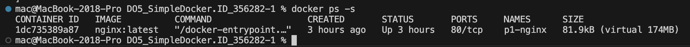
Замапленные порты: нет (контейнерные 80/tcp не опубликованы на хост)
Ip:
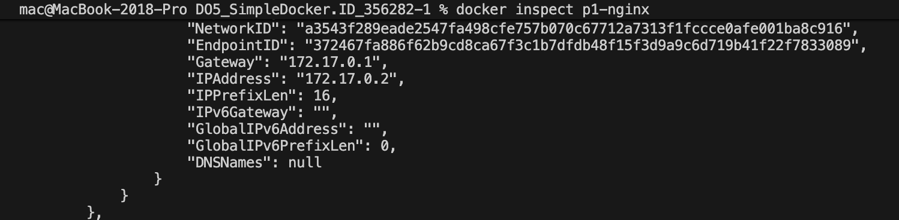

##### Останови докер контейнер через `docker stop [container_id|container_name]`.
##### Проверь, что контейнер остановился через `docker ps`.
##### Запусти докер с портами 80 и 443 в контейнере, замапленными на такие же порты на локальной машине, через команду *run*.
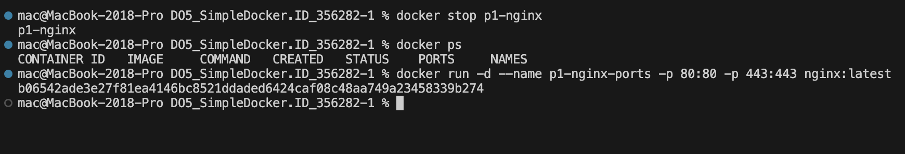
##### Проверь, что в браузере по адресу *localhost:80* доступна стартовая страница **nginx**.
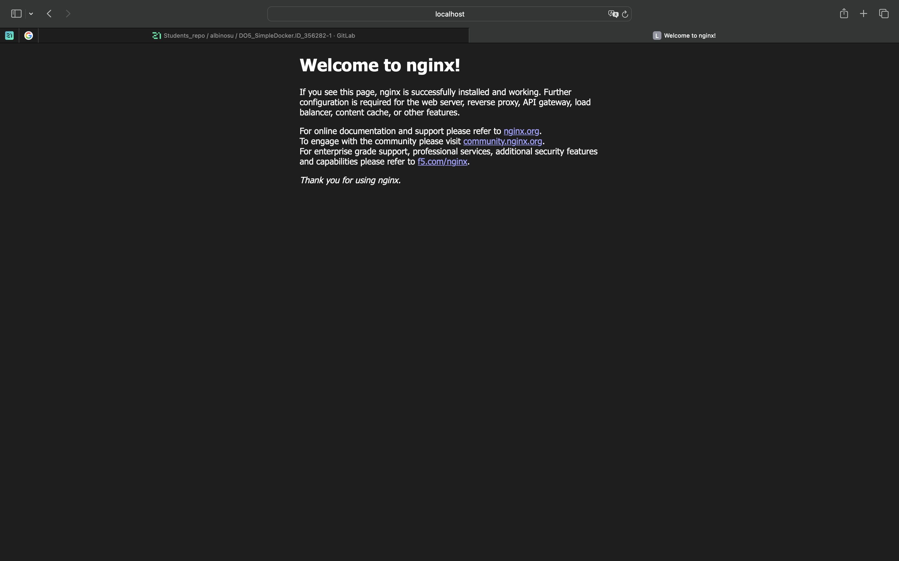
##### Перезапусти докер контейнер через `docker restart [container_id|container_name]`.
##### Проверь любым способом, что контейнер запустился.
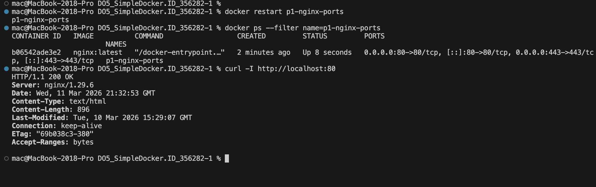

## Part 2. Операции с контейнером

Докер-образ и контейнер готовы. Теперь можно покопаться в конфигурации **nginx** и отобразить статус страницы.

**== Задание ==**

##### Прочитай конфигурационный файл *nginx.conf* внутри докер контейнера через команду *exec*.
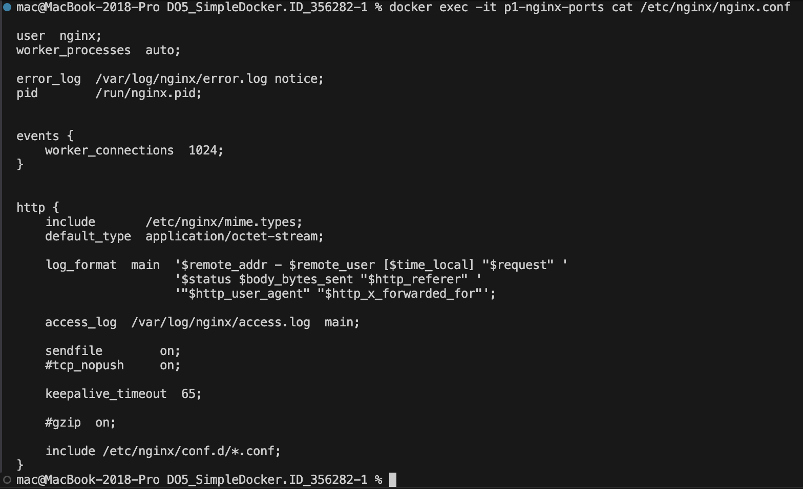
##### Создай на локальной машине файл *nginx.conf*.
##### Настрой в нем по пути */status* отдачу страницы статуса сервера **nginx**.
##### Скопируй созданный файл *nginx.conf* внутрь докер-образа через команду `docker cp`.
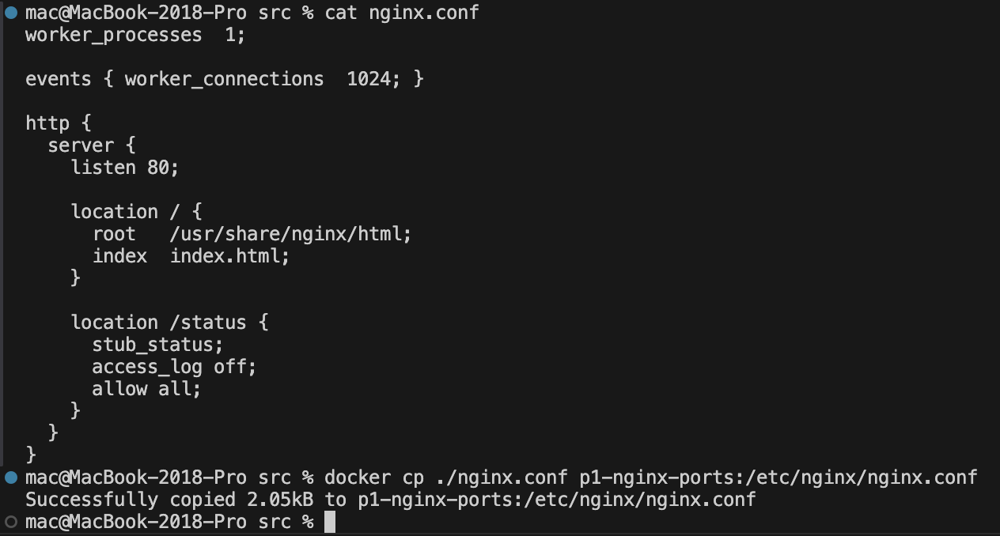
##### Перезапусти **nginx** внутри докер-образа через команду *exec*.
##### Проверь, что по адресу *localhost:80/status* отдается страничка со статусом сервера **nginx**.
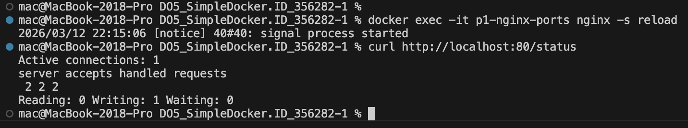
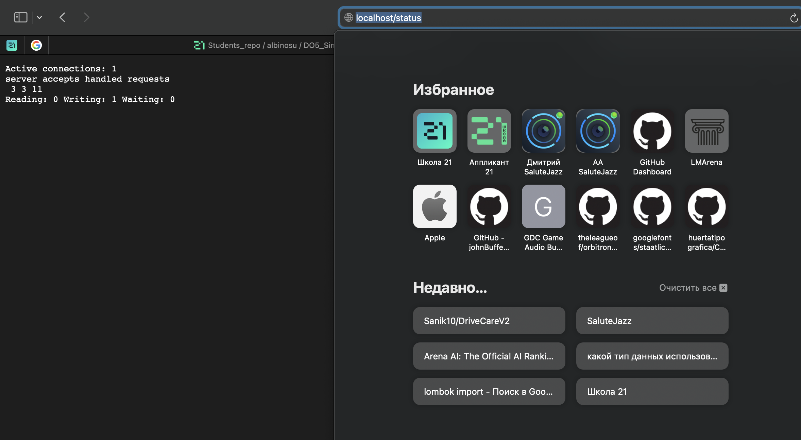
##### Экспортируй контейнер в файл *container.tar* через команду *export*.
##### Останови контейнер.
##### Удали образ через `docker rmi [image_id|repository]`, не удаляя перед этим контейнеры.
##### Удали остановленный контейнер.
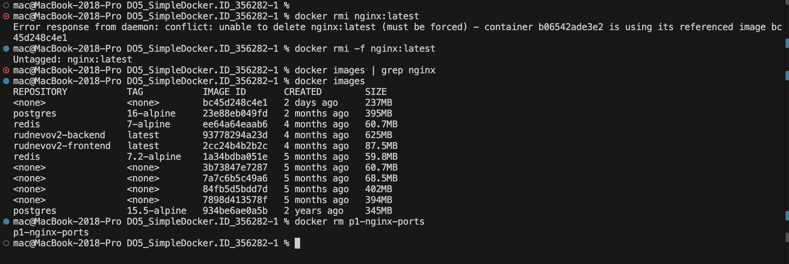
##### Импортируй контейнер обратно через команду *import*.
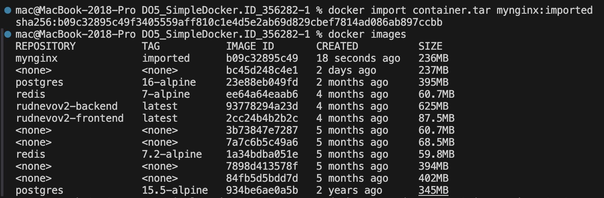
##### Запусти импортированный контейнер.
##### Проверь, что по адресу *localhost:80/status* отдается страничка со статусом сервера **nginx**.
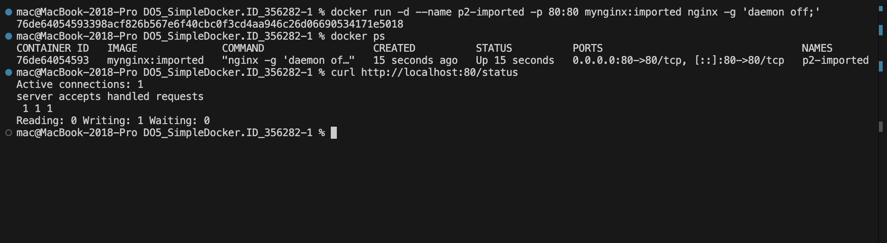
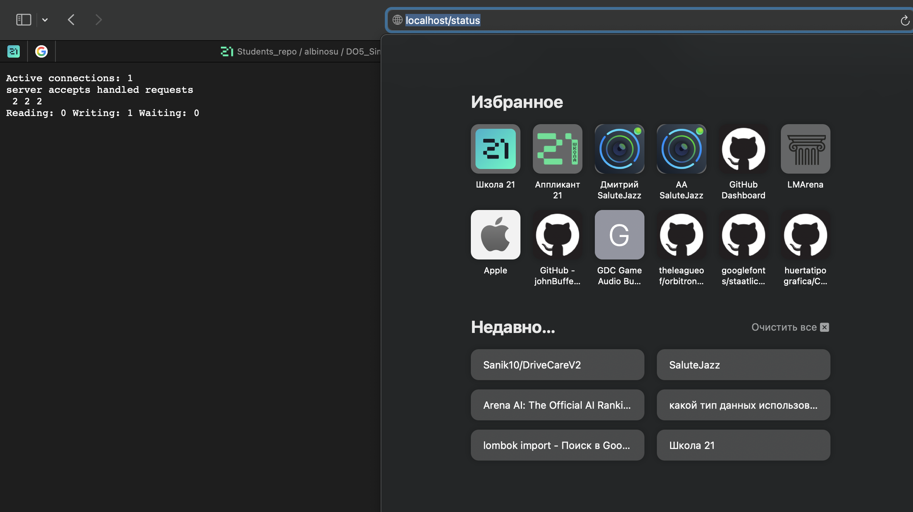

- В отчёт помести скрины:
  - вызова и вывода всех использованных в этой части задания команд;
  - содержимое созданного файла *nginx.conf*;
  - страницы со статусом сервера **nginx** по адресу *localhost:80/status*.

## Part 3. Мини веб-сервер

Теперь стоит немного оторваться от докера, чтобы подготовиться к последнему этапу. Время написать свой сервер.

**== Задание ==**

##### Напиши мини-сервер на **C** и **FastCgi**, который будет возвращать простейшую страничку с надписью `Hello, World!`.
##### Запусти написанный мини-сервер через *spawn-fcgi* на порту 8080.
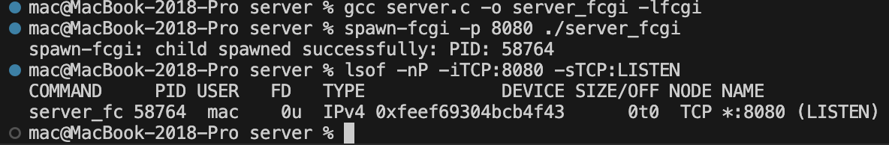
##### Напиши свой *nginx.conf*, который будет проксировать все запросы с 81 порта на *127.0.0.1:8080*.
##### Запусти локально **nginx** с написанной конфигурацией.
##### Проверь, что в браузере по *localhost:81* отдается написанная тобой страничка.
##### Положи файл *nginx.conf* по пути *./nginx/nginx.conf* (это понадобится позже).
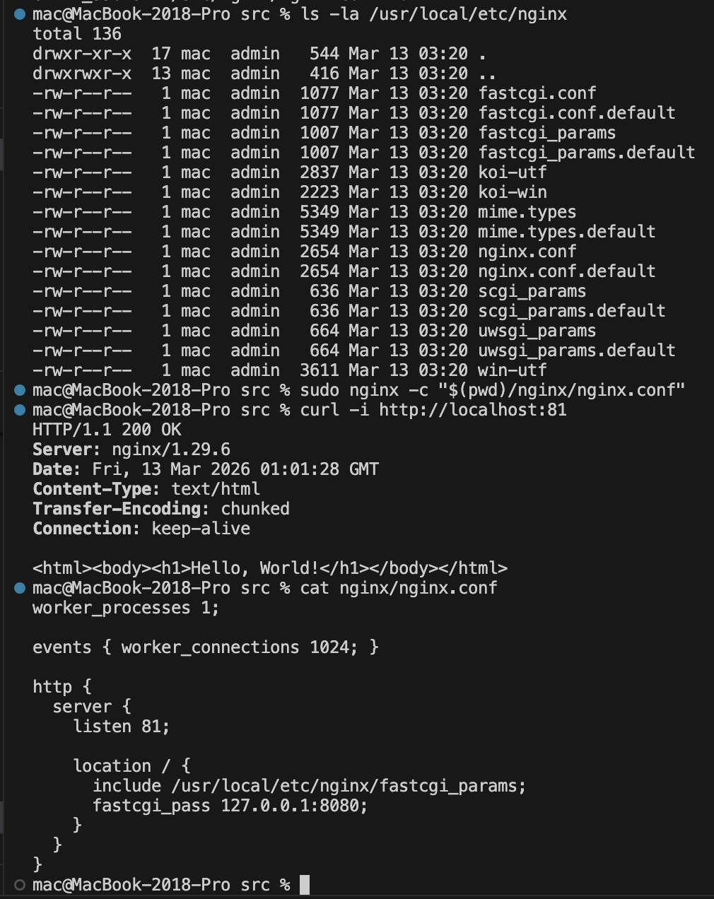
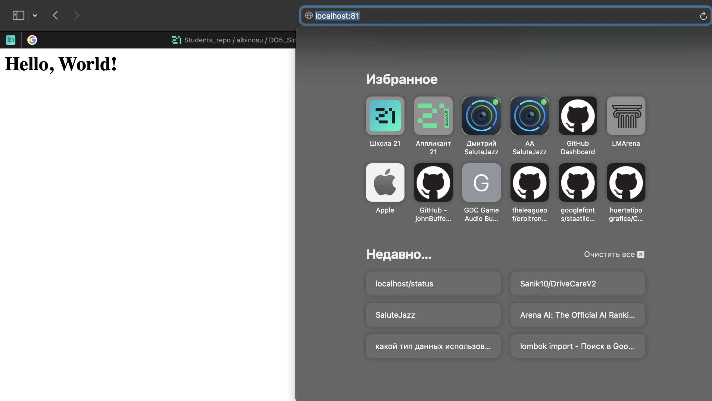

## Part 4. Свой докер

Теперь всё готово. Можно приступать к написанию докер-образа для созданного сервера.

**== Задание ==**

*При написании докер-образа избегай множественных вызовов команд RUN*

#### Напиши свой докер-образ, который:
##### 1) собирает исходники мини сервера на FastCgi из [Части 3](#part-3-мини-веб-сервер);
##### 2) запускает его на 8080 порту;
##### 3) копирует внутрь образа написанный *./nginx/nginx.conf*;
##### 4) запускает **nginx**.
_**nginx** можно установить внутрь докера самостоятельно, а можно воспользоваться готовым образом с **nginx**'ом, как базовым._

##### Собери написанный докер-образ через `docker build` при этом указав имя и тег.
##### Проверь через `docker images`, что все собралось корректно.
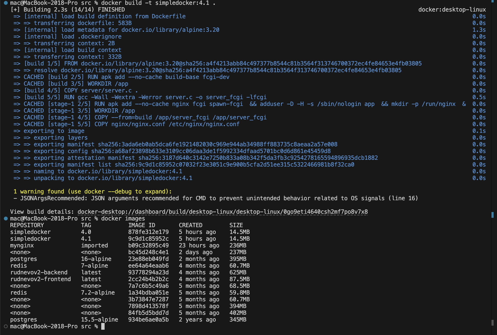
##### Запусти собранный докер-образ с маппингом 81 порта на 80 на локальной машине и маппингом папки *./nginx* внутрь контейнера по адресу, где лежат конфигурационные файлы **nginx**'а (см. [Часть 2](#part-2-операции-с-контейнером)).
##### Проверь, что по localhost:80 доступна страничка написанного мини сервера.
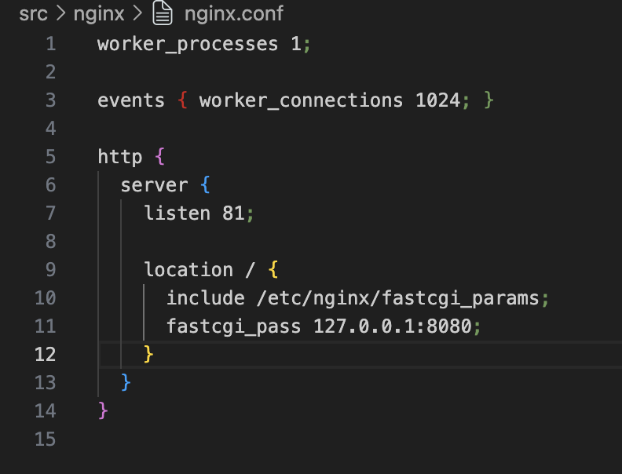
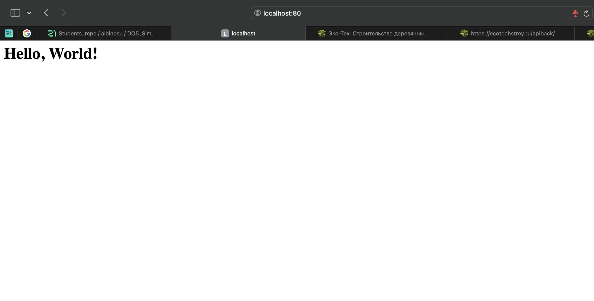
##### Допиши в *./nginx/nginx.conf* проксирование странички */status*, по которой надо отдавать статус сервера **nginx**.
##### Пересобери докер-образ.
*Если всё сделано верно, то, после сохранения файла и перезапуска контейнера, конфигурационный файл внутри докер-образа должен обновиться самостоятельно без лишних действий*.
##### Проверь, что теперь по *localhost:80/status* отдается страничка со статусом **nginx**
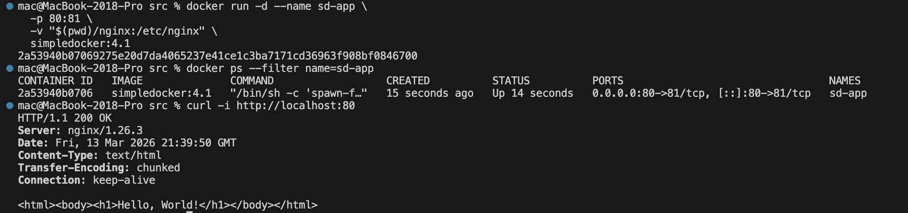
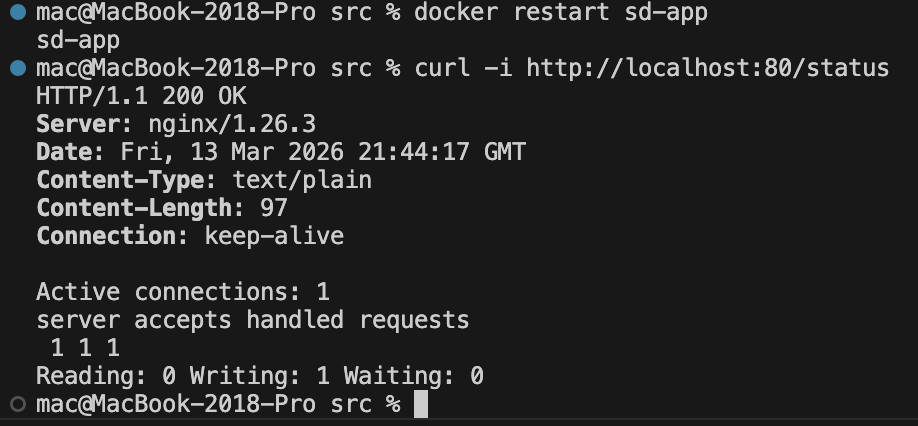
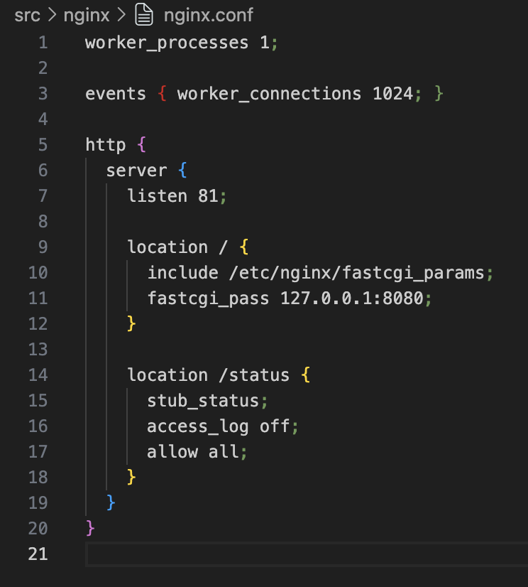

## Part 5. **Dockle**

После написания образа никогда не будет лишним проверить его на безопасность.

**== Задание ==**

##### Просканируй образ из предыдущего задания через `dockle [image_id|repository]`.
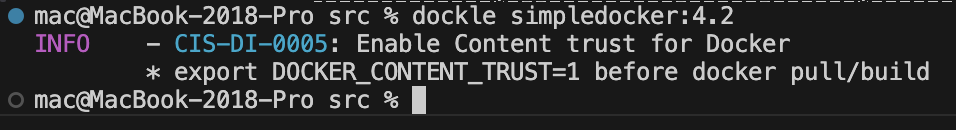
##### Исправь образ так, чтобы при проверке через **dockle** не было ошибок и предупреждений.
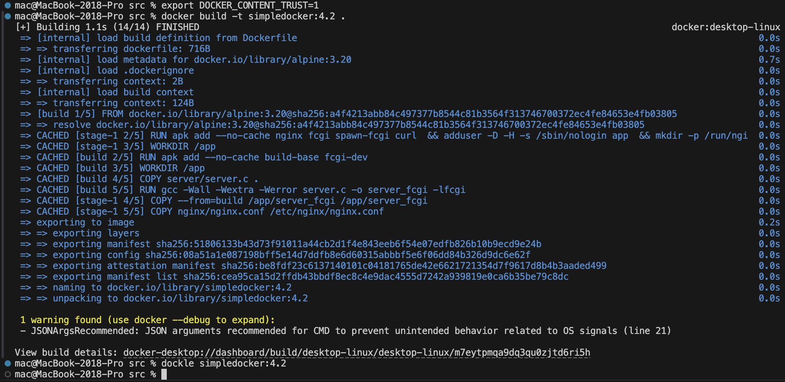

## Part 6. Базовый **Docker Compose**

Вот ты и закончил свою разминку. А хотя погоди...
Почему бы не поэкспериментировать с развёртыванием проекта, состоящего сразу из нескольких докер-образов?

**== Задание ==**

##### Напиши файл *docker-compose.yml*, с помощью которого:
##### 1) Подними докер-контейнер из [Части 5](#part-5-инструмент-dockle) _(он должен работать в локальной сети, т. е. не нужно использовать инструкцию **EXPOSE** и мапить порты на локальную машину)_.
##### 2) Подними докер-контейнер с **nginx**, который будет проксировать все запросы с 8080 порта на 81 порт первого контейнера.
##### Замапь 8080 порт второго контейнера на 80 порт локальной машины.
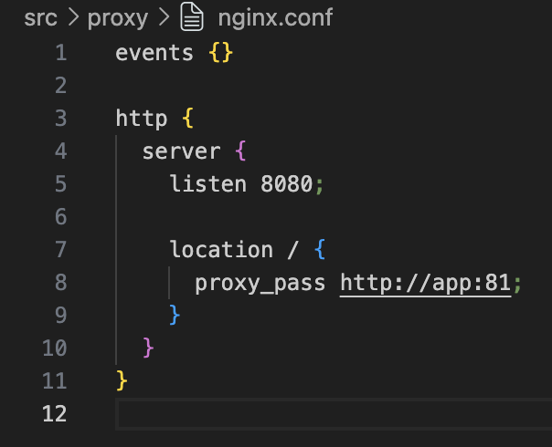

##### Останови все запущенные контейнеры.
##### Собери и запусти проект с помощью команд `docker-compose build` и `docker-compose up`.
##### Проверь, что в браузере по *localhost:80* отдается написанная тобой страничка, как и ранее.
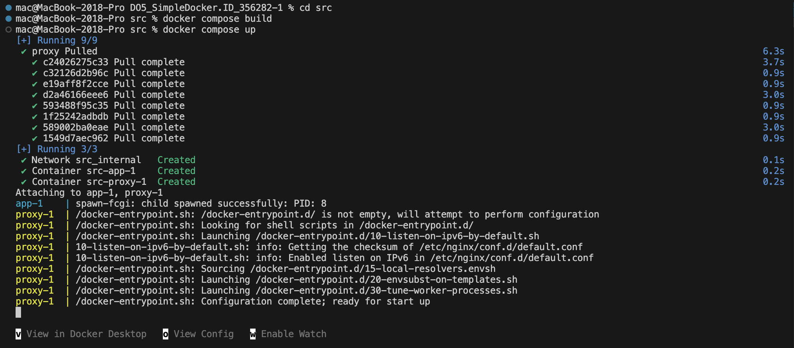
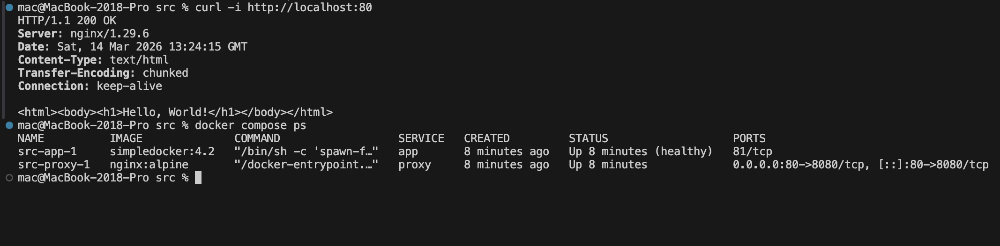
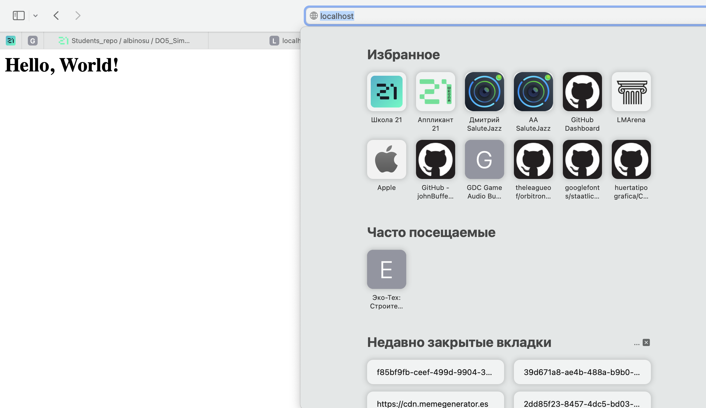