### Part 1. Настройка **gitlab-runner**

##### Подними виртуальную машину *Ubuntu Server 22.04 LTS*.
*Будь готов, что в конце проекта нужно будет сохранить дамп образа виртуальной машины.*

##### Скачай и установи на виртуальную машину **gitlab-runner**.

##### Запусти **gitlab-runner** и зарегистрируй его для использования в текущем проекте (*DO6_CICD*).
- Для регистрации понадобятся URL и токен, которые можно получить на страничке задания на платформе.

---
был скачен докер, гитлаб раннер, все они добавлены в группу docker для возможности вводить команды без sudo - для удобства, и зарегестрирован раннер по токену из задания для DO6
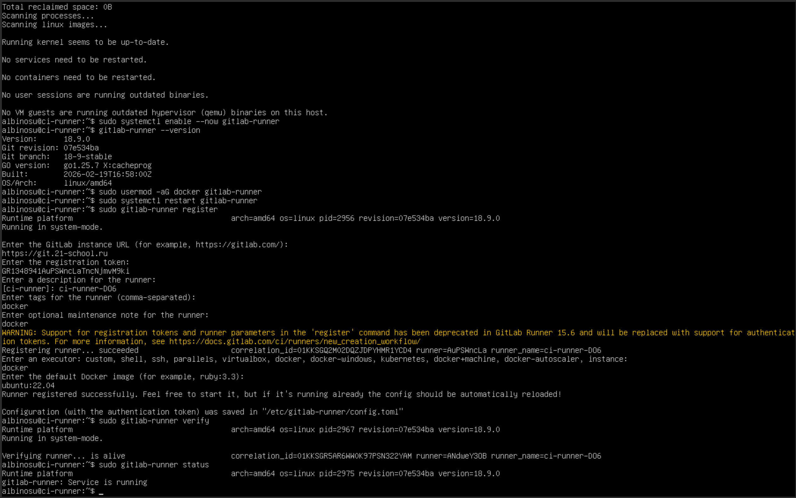

### Part 2. Сборка

Напиши этап для **CI** по сборке приложений из проекта *SimpleBashUtils*.

В файле _.gitlab-ci.yml_ добавь этап запуска сборки через мейк файл из проекта _SimpleBashUtils_.

Файлы, полученные после сборки (артефакты), сохрани в произвольную директорию со сроком хранения 30 дней.
---
Файлик "Непрерывной интеграции":
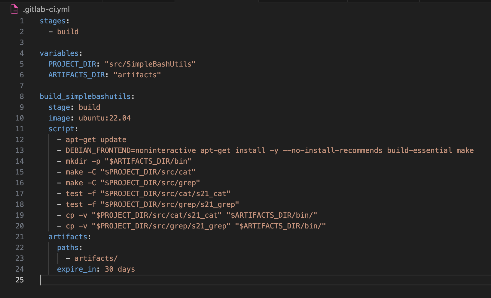
тестовый коммит
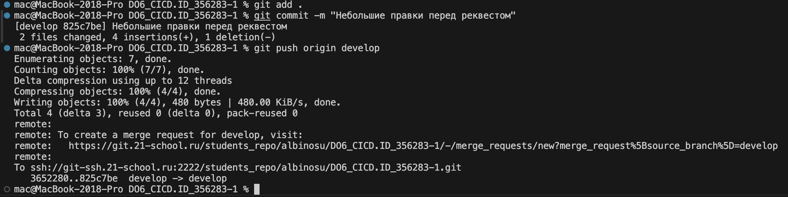
(/me бесчисленное количество попыток найти Пайплайн и почему статус "Пендинг" - нет раннеров, хотя регал выше -_-)

---
перерег раннера
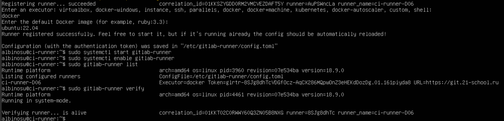

Успешный успех!
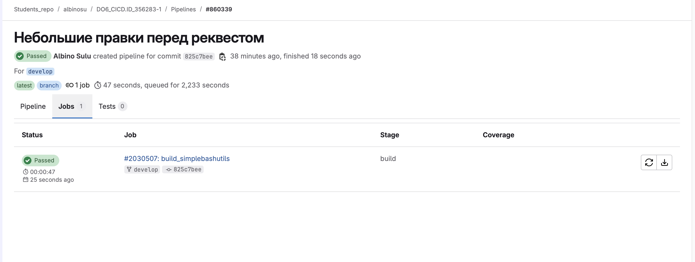
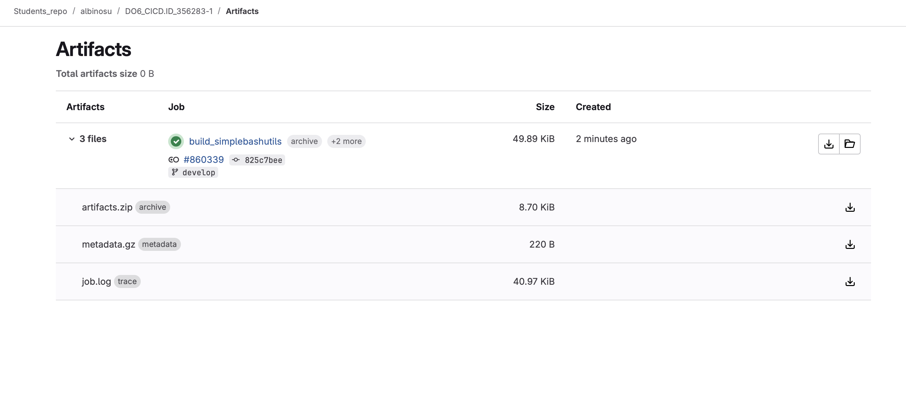

### Part 3. Тест кодстайла

---
`-`Поздравляю, ты выполнил абсолютно бессмысленную задачу.

**== Задание ==**

#### Напиши этап для **CI**, который запускает скрипт кодстайла (*clang-format*).

##### Если кодстайл не прошел, то «зафейли» пайплайн.

##### В пайплайне отобрази вывод утилиты *clang-format*.

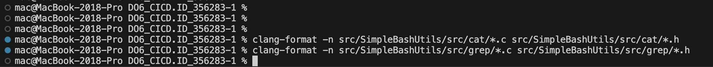

сейчас стиль кода идеальный. Немного ломаем его!

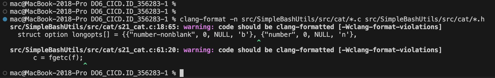
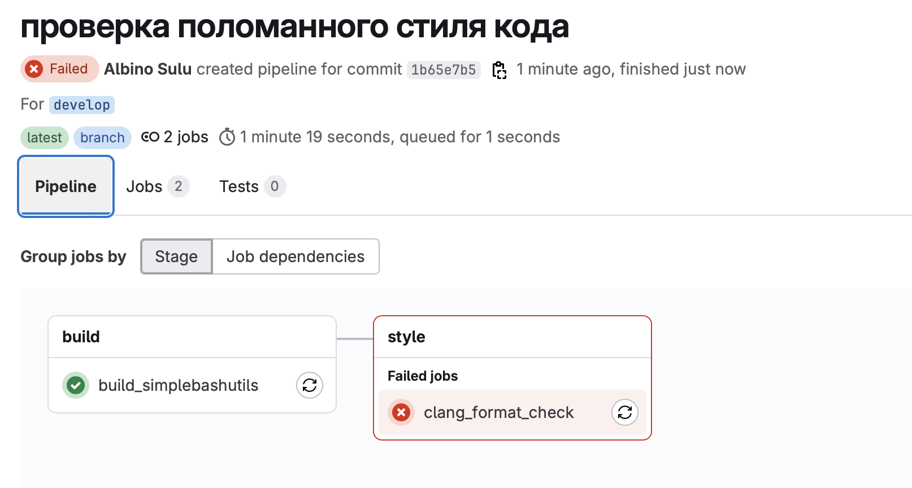

---
Правим стиль кода и запускаем повторно
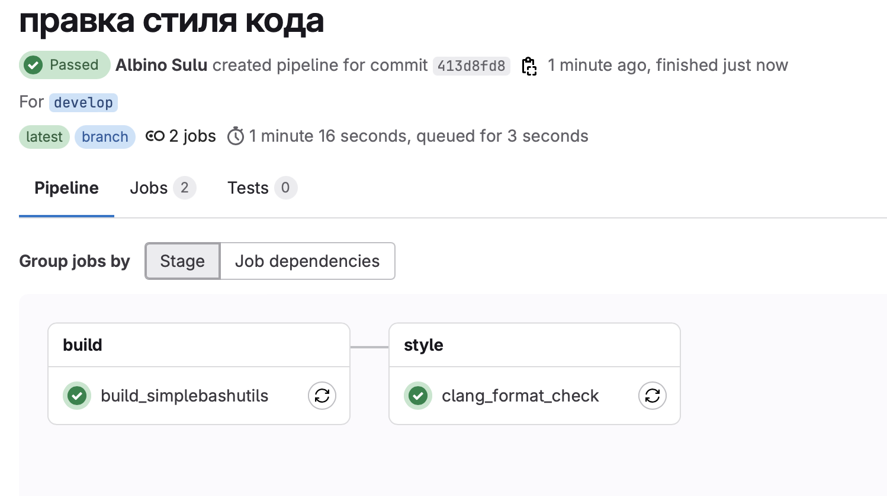

### Part 4. Интеграционные тесты

`-` Отлично, тест на кодстайл написан. [ТИШЕ] Говорю с тобой тет-а-тет. Не говори ничего коллегам. Между нами: ты справляешься очень хорошо. [ГРОМЧЕ] Переходим к написанию интеграционных тестов.

**== Задание ==**

#### Напиши этап для **CI**, который запустит интеграционные тесты.

##### Для проекта *SimpleBashUtils* можешь взять свои уже написанные интеграционные тесты.

##### Для проекта из папки code-samples напиши интеграционные тесты самостоятельно. Тесты могут быть написаны на любом языке (c, bash, python и т.д.) и должны вызывать собранное приложение для проверки его работоспособности на разных случаях.

##### Запусти этот этап автоматически только при условии, если сборка и тест кодстайла прошли успешно.

##### Если тесты не прошли, то «зафейли» пайплайн.

##### В пайплайне отобрази вывод, что интеграционные тесты успешно прошли / провалились.

тесты написаны и первые 2 пайплайна не прошли. После правок кода cat и grep - работает один в один с утилитами Linux'a.
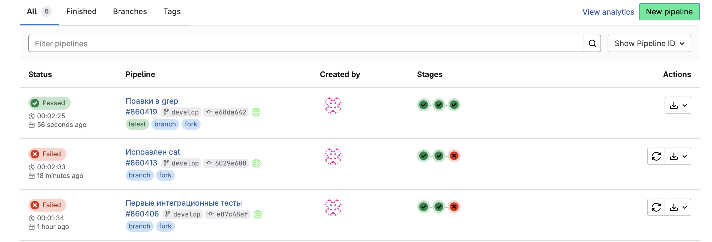
вот так выглядят джобы стиля кода и интеграционных тестов:
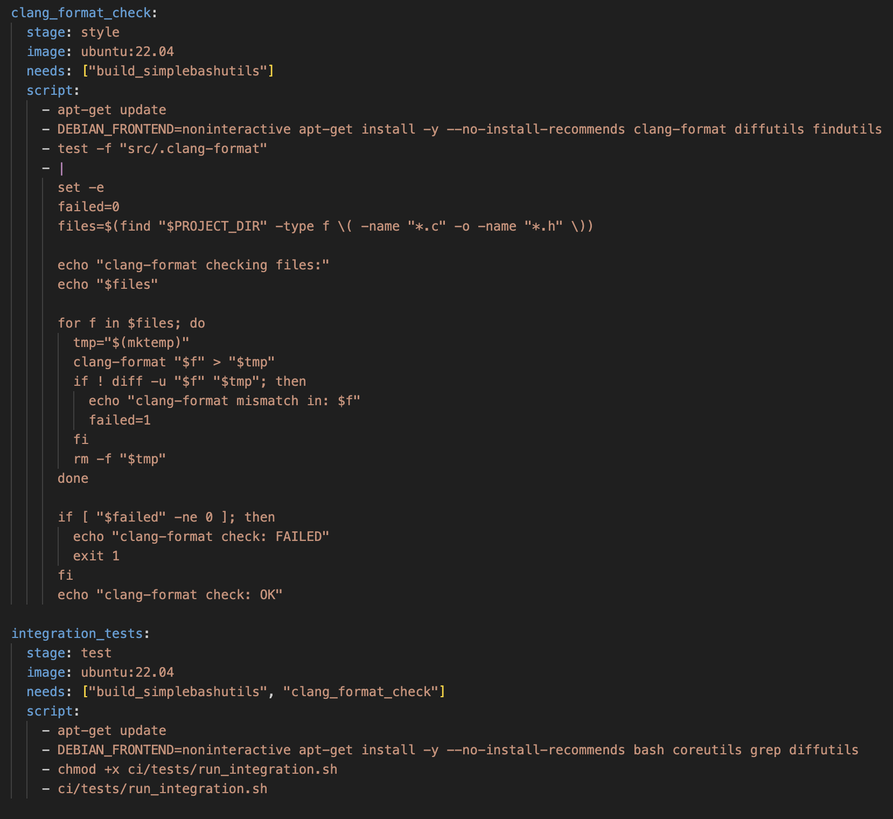

### Part 5. Этап деплоя

`-` Для завершения этого задания ты должен перенести исполняемые файлы на другую виртуальную машину, которая будет играть роль продакшна. Удачи.

**== Задание ==**

##### Подними вторую виртуальную машину *Ubuntu Server 22.04 LTS*.

#### Напиши этап для **CD**, который «разворачивает» проект на другой виртуальной машине.

##### Запусти этот этап вручную при условии, что все предыдущие этапы прошли успешно.

##### Напиши bash-скрипт, который при помощи **ssh** и **scp** копирует файлы, полученные после сборки (артефакты), в директорию */usr/local/bin* второй виртуальной машины.

##### В файле _.gitlab-ci.yml_ добавь этап запуска написанного скрипта.

##### В случае ошибки «зафейли» пайплайн.

спустя несколько часов настройки ключей на машинах деплой работает как надо!
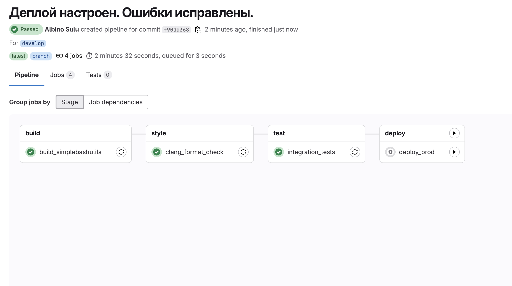
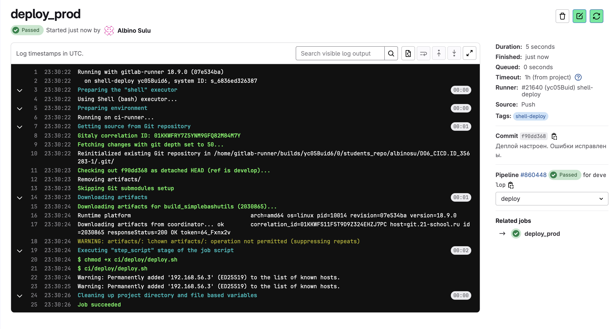
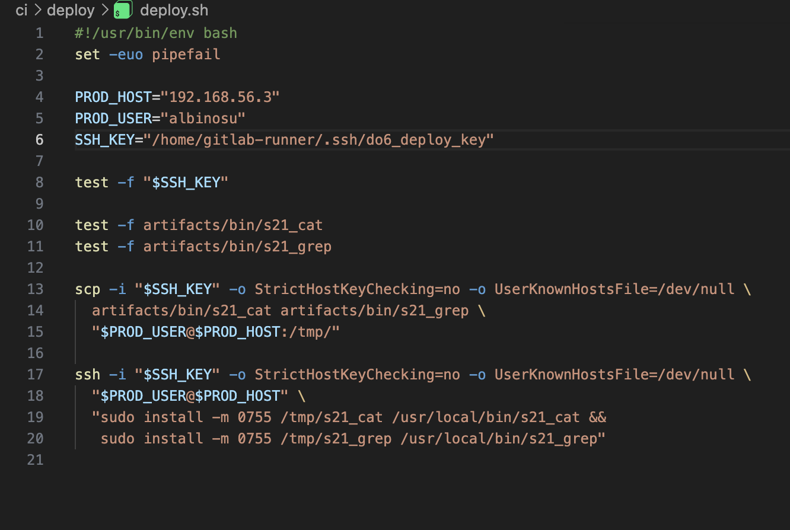

В результате ты должен получить готовое к работе приложения из проекта *SimpleBashUtils* (*cat* и *grep*) или приложение из папки code-samples (*DO*) на второй виртуальной машине (в зависимости от того, что ты выполнял).

##### Сохрани дампы образов виртуальных машин.
**P.S. Ни в коем случае не сохраняй дампы в гит!**
- Не забудь запустить пайплайн с последним коммитом в репозитории.

### Part 6. Дополнительно. Уведомления

`-` Здесь написано, что твое следующее задание выполняется специально для нобелевских лауреатов. Здесь не сказано, за что они получили премию, но точно не за умение работать с **gitlab-runner**.

**== Задание ==**

#### Настрой уведомления об успешном/неуспешном выполнении пайплайна через бота с именем «[твой nickname] DO6 CI/CD» в *Telegram*.

уже 2-ой пайплайн падает из-за разрыва соединения с tg
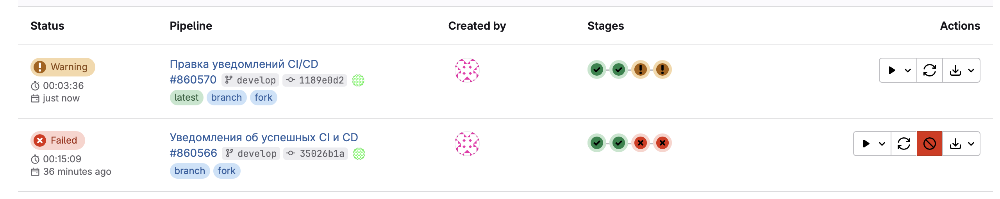

спустя несколько часов были приняты решения:
- CI/CD джобы на VM не могут стабильно ходить в api.telegram.org (TLS EOF/timeout).
- Поднят relay на Mac: 0.0.0.0:8099, доступен из host-only сети как http://192.168.56.1:8099/send.
- Джобы GitLab отправляют уведомление в relay, relay уже отправляет в Telegram.

тестовая отправка сообщения:
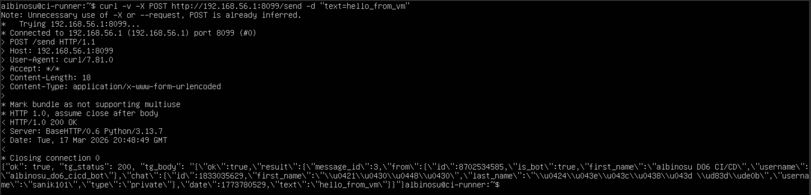
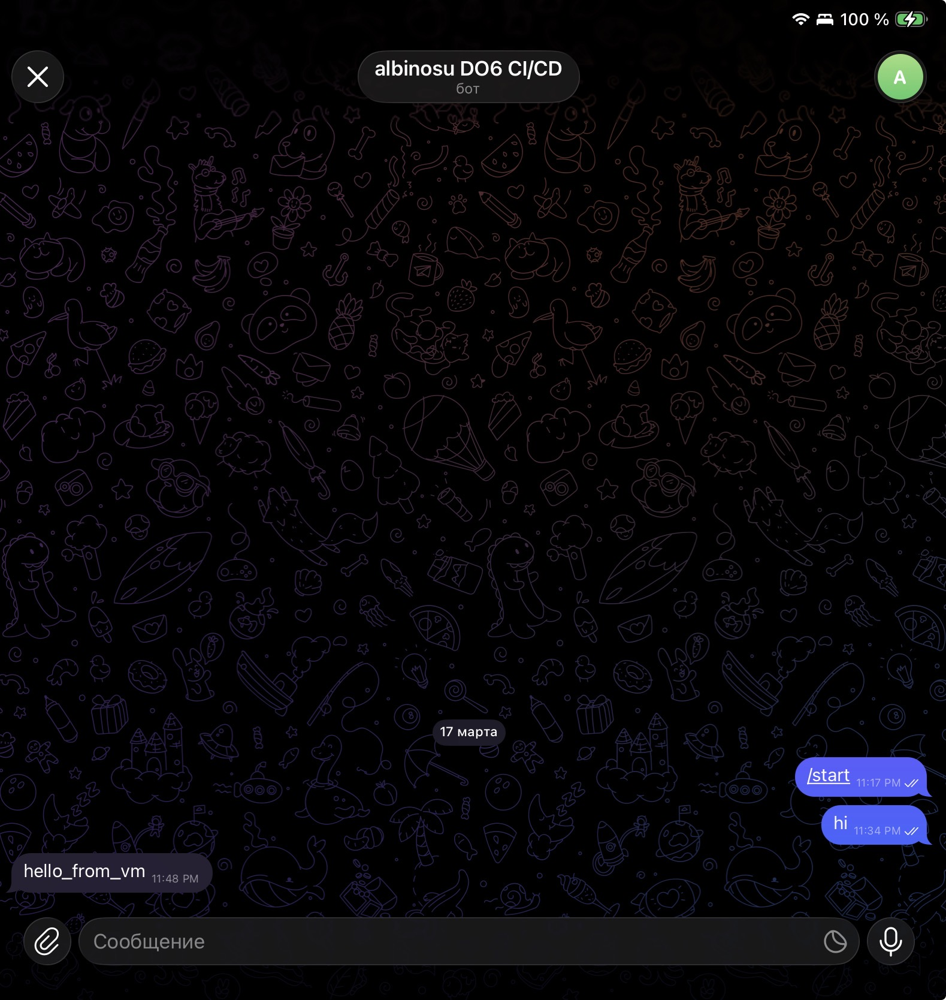
логика простая:
- ci-runner получает инфо, что проект протестирован
- отправляет 3 попытки отправки сообщения на relay об отправке сообщения "успешного CI" в тг'щке
- relay уже сам отправит с MacOS, а не с Virtual Machine сообщение в тг'щке
---
Теперь вносим эту идею в yml и смотрим результат:
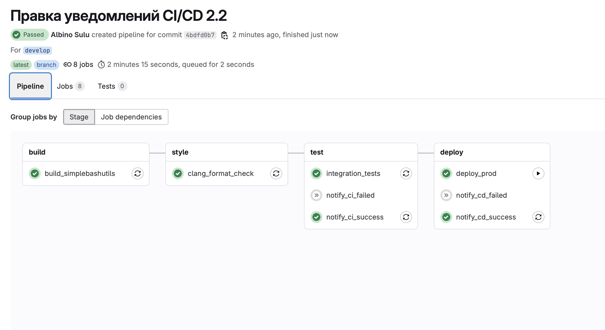
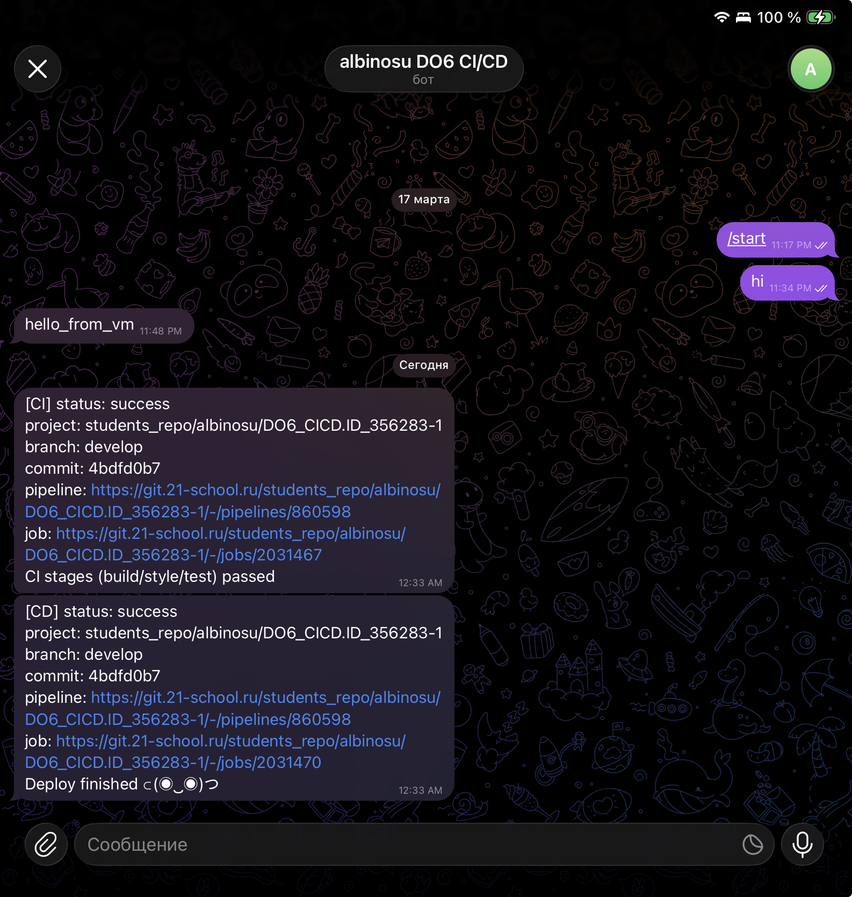

- Текст уведомления должен содержать информацию об успешности прохождения как этапа **CI**, так и этапа **CD**.
- В остальном текст уведомления может быть произвольным.
